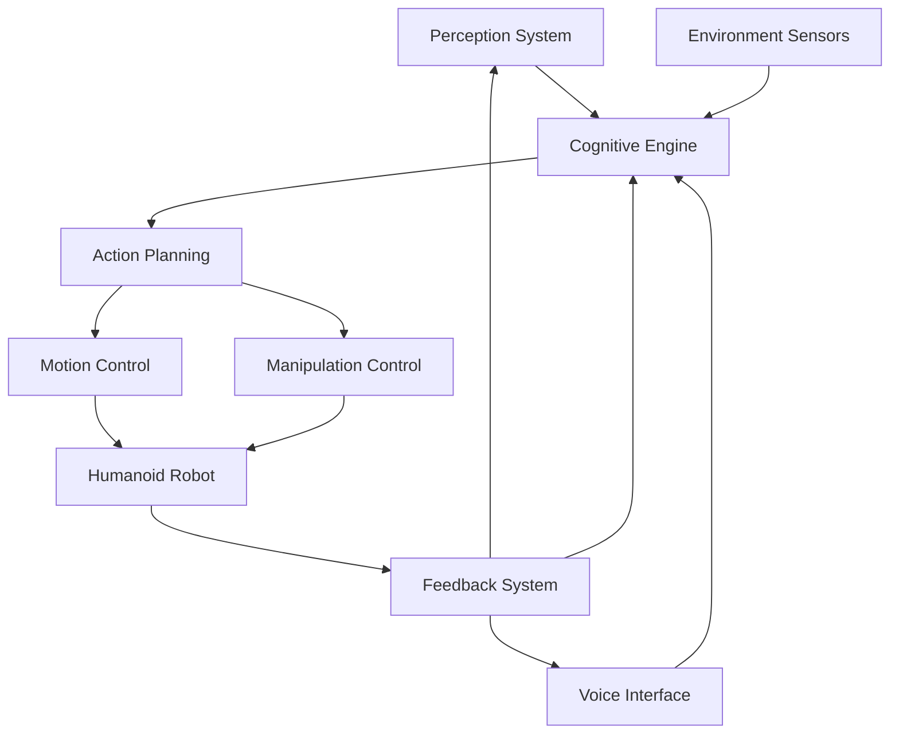
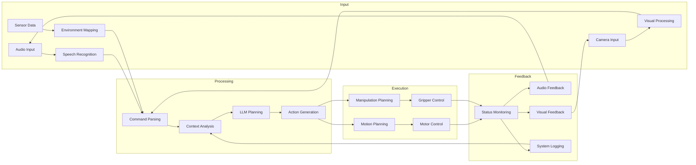
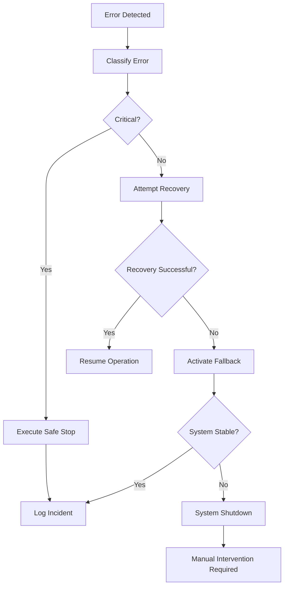
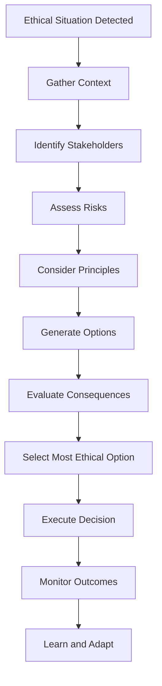
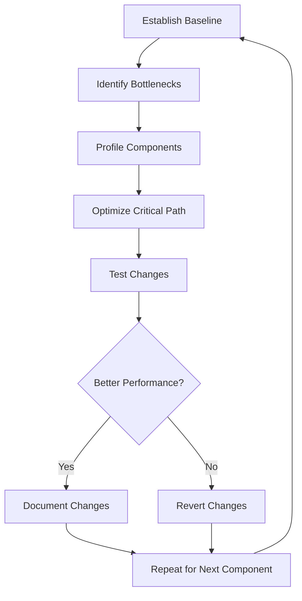
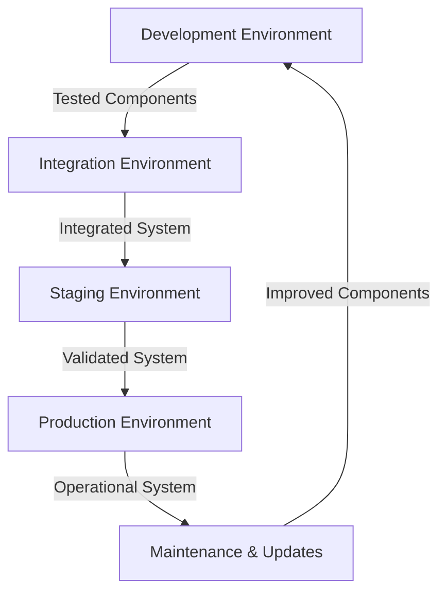

# Capstone: The Autonomous Humanoid

## Learning Objectives

By the end of this capstone project, students should be able to:

- Integrate all VLA components into a comprehensive system
- Design architecture for autonomous humanoid robots
- Implement system integration patterns and interfaces
- Optimize performance for real-time operation
- Develop robust error recovery mechanisms
- Apply safety protocols for autonomous systems
- Consider ethical implications of humanoid robotics
- Demonstrate a working autonomous humanoid system

## Introduction to Autonomous Humanoid Systems

This capstone project brings together all the concepts from Modules 1-4 to create a comprehensive autonomous humanoid robot system. Students will integrate perception, cognition, action, and human interaction into a unified, functional system.

### The Autonomous Humanoid Architecture



**Key Components:**
- **Perception**: Vision, depth sensing, object recognition
- **Voice Interface**: Speech recognition and synthesis
- **Cognitive Engine**: LLM-based planning and decision making
- **Action Planning**: Task decomposition and execution
- **Motion Control**: Locomotion and posture management
- **Manipulation**: Arm and gripper control
- **Feedback System**: Multi-modal status reporting

## System Integration Overview

### Integration Architecture Patterns

1. **Modular Design**: Separate components with clear interfaces
2. **Event-Driven**: Asynchronous communication between modules
3. **Data Flow**: Unidirectional data pipelines
4. **State Management**: Centralized system state
5. **Error Propagation**: Structured error handling

### Component Interface Specification

```json
{
  "component": "string",
  "version": "semver",
  "inputs": [
    {
      "name": "string",
      "type": "data_type",
      "description": "string",
      "required": true/false
    }
  ],
  "outputs": [
    {
      "name": "string",
      "type": "data_type",
      "description": "string"
    }
  ],
  "methods": [
    {
      "name": "string",
      "parameters": ["string"],
      "returns": "data_type",
      "description": "string"
    }
  ],
  "dependencies": ["component_name"],
  "safety_requirements": ["string"]
}
```

### ROS 2 Integration Architecture

```python
# Example ROS 2 node structure for integrated system
class AutonomousHumanoidNode(Node):
    def __init__(self):
        super().__init__('autonomous_humanoid')

        # Component interfaces
        self.perception_client = self.create_client(
            PerceptionService,
            'perception_service'
        )

        self.voice_client = self.create_client(
            VoiceService,
            'voice_service'
        )

        self.planning_client = self.create_client(
            PlanningService,
            'planning_service'
        )

        self.motion_client = self.create_client(
            MotionService,
            'motion_service'
        )

        # System state
        self.system_state = {
            'operational': False,
            'current_task': None,
            'battery_level': 100,
            'safety_status': 'normal'
        }

        # Main control loop
        self.control_timer = self.create_timer(0.1, self.control_loop)
```

## Data Flow Design

### End-to-End VLA System Data Flow



### Data Format Standards

```python
# Standard data structures for system integration

class PerceptionData:
    def __init__(self):
        self.objects = []  # Detected objects with positions
        self.humans = []   # Detected humans with poses
        self.environment_map = None  # 3D map data
        self.timestamp = None
        self.confidence_scores = {}

class VoiceCommand:
    def __init__(self):
        self.text = ""
        self.intent = ""
        self.parameters = {}
        self.confidence = 0.0
        self.timestamp = None

class ActionPlan:
    def __init__(self):
        self.plan_id = ""
        self.steps = []
        self.estimated_duration = 0
        self.safety_checks = []
        self.fallback_plan = None

class SystemStatus:
    def __init__(self):
        self.operational = False
        self.current_task = None
        self.errors = []
        self.warnings = []
        self.battery_level = 100
        self.timestamp = None
```

## Performance Optimization

### Real-Time Operation Strategies

1. **Parallel Processing**: Run perception and planning concurrently
2. **Caching**: Cache frequent command patterns and responses
3. **Model Optimization**: Use quantized LLM models for faster inference
4. **Data Compression**: Compress sensor data streams
5. **Priority Scheduling**: Prioritize critical system functions

### Resource Management

```python
class ResourceManager:
    def __init__(self):
        self.cpu_usage = {}
        self.memory_usage = {}
        self.gpu_usage = {}
        self.priority_queue = []

    def allocate_resources(self, task: Dict) -> bool:
        """Allocate resources based on task priority"""

        # Check available resources
        available_cpu = self._get_available_cpu()
        available_memory = self._get_available_memory()
        available_gpu = self._get_available_gpu()

        # Calculate required resources
        required_cpu = task.get('cpu_requirement', 0)
        required_memory = task.get('memory_requirement', 0)
        required_gpu = task.get('gpu_requirement', 0)

        # Check if resources are available
        if (available_cpu >= required_cpu and
            available_memory >= required_memory and
            available_gpu >= required_gpu):

            # Allocate resources
            self._allocate_cpu(task, required_cpu)
            self._allocate_memory(task, required_memory)
            self._allocate_gpu(task, required_gpu)

            # Add to priority queue
            self.priority_queue.append(task)
            self.priority_queue.sort(key=lambda x: x.get('priority', 0), reverse=True)

            return True

        return False

    def optimize_performance(self):
        """Optimize system performance dynamically"""

        # Monitor resource usage
        self._monitor_resources()

        # Adjust priorities based on system state
        if self._is_battery_low():
            self._reduce_non_critical_tasks()

        if self._is_high_load():
            self._shed_low_priority_tasks()

        # Balance workload
        self._balance_workload()
```

### Performance Benchmarking

| Component | Target Performance | Optimization Strategy |
|-----------|-------------------|----------------------|
| Speech Recognition | &lt;1s response | Use smaller Whisper model |
| Visual Processing | &lt;500ms frame | Optimize neural networks |
| LLM Planning | &lt;3s response | Use quantized models |
| Motion Control | &lt;100ms update | Low-level optimization |
| System Latency | &lt;200ms end-to-end | Parallel processing |

## Error Recovery Mechanisms

### Robust Operation Strategies

1. **Graceful Degradation**: Reduce functionality when resources are low
2. **Fallback Plans**: Predefined backup strategies
3. **Error Isolation**: Contain errors to specific components
4. **Automatic Recovery**: Self-healing mechanisms
5. **Safe States**: Known safe configurations to return to

### Comprehensive Error Handling System

```python
class ErrorRecoverySystem:
    def __init__(self):
        self.error_handlers = {
            'speech_recognition': self._handle_speech_error,
            'visual_processing': self._handle_vision_error,
            'planning': self._handle_planning_error,
            'motion': self._handle_motion_error,
            'system': self._handle_system_error
        }

        self.fallback_plans = {
            'navigation': self._navigation_fallback,
            'manipulation': self._manipulation_fallback,
            'communication': self._communication_fallback
        }

        self.recovery_log = []

    def handle_error(self, error: Exception, context: Dict) -> bool:
        """Handle errors with appropriate recovery strategies"""

        error_type = self._classify_error(error)
        handler = self.error_handlers.get(error_type, self._handle_generic_error)

        try:
            recovery_success = handler(error, context)

            # Log the recovery attempt
            self._log_recovery(error_type, recovery_success, context)

            return recovery_success

        except Exception as recovery_error:
            self._log_recovery(error_type, False, context, str(recovery_error))
            return False

    def _classify_error(self, error: Exception) -> str:
        """Classify error by type and component"""

        error_type = type(error).__name__

        if 'Speech' in error_type or 'Audio' in error_type:
            return 'speech_recognition'

        if 'Vision' in error_type or 'Camera' in error_type:
            return 'visual_processing'

        if 'Plan' in error_type or 'LLM' in error_type:
            return 'planning'

        if 'Motion' in error_type or 'Motor' in error_type:
            return 'motion'

        return 'system'

    def _handle_speech_error(self, error: Exception, context: Dict) -> bool:
        """Handle speech recognition errors"""

        # Try alternative audio source
        if context.get('audio_source') == 'primary':
            context['audio_source'] = 'secondary'
            return True

        # Use text fallback if available
        if 'text_fallback' in context:
            return self._use_text_fallback(context)

        # Last resort: request repetition
        self._request_repetition()
        return False

    def activate_fallback(self, component: str, context: Dict) -> bool:
        """Activate fallback plan for a component"""

        fallback = self.fallback_plans.get(component)
        if fallback:
            return fallback(context)

        # Generic fallback: safe stop
        self._execute_safe_stop()
        return True
```

### Error Recovery Flowchart



## Safety Protocols

### Comprehensive Safety Framework

1. **Physical Safety**: Protect humans and environment
2. **System Safety**: Prevent robot damage
3. **Data Safety**: Secure sensitive information
4. **Operational Safety**: Ensure reliable performance
5. **Ethical Safety**: Maintain ethical standards

### Safety Implementation

```python
class SafetySystem:
    def __init__(self):
        self.safety_rules = {
            'emergency_stop': {
                'trigger': ['emergency_button', 'voice_command:stop', 'obstacle_proximity<0.2'],
                'action': 'immediate_halt',
                'priority': 10
            },
            'high_temperature': {
                'trigger': ['cpu_temp>85', 'motor_temp>70'],
                'action': 'reduce_load',
                'priority': 8
            },
            'low_battery': {
                'trigger': ['battery_level<15'],
                'action': 'return_to_charger',
                'priority': 7
            },
            'human_proximity': {
                'trigger': ['human_distance<0.5', 'motion_detected'],
                'action': 'slow_down',
                'priority': 9
            }
        }

        self.safety_state = 'normal'
        self.safety_log = []

    def check_safety(self, system_state: Dict) -> str:
        """Check system safety and return safety state"""

        triggered_rules = []

        for rule_name, rule in self.safety_rules.items():
            for trigger in rule['trigger']:
                if self._evaluate_trigger(trigger, system_state):
                    triggered_rules.append(rule_name)
                    break

        if triggered_rules:
            # Get highest priority rule
            highest_priority_rule = max(
                [r for r in triggered_rules],
                key=lambda r: self.safety_rules[r]['priority']
            )

            # Execute safety action
            action = self.safety_rules[highest_priority_rule]['action']
            self._execute_safety_action(action)

            # Update safety state
            self.safety_state = 'alert'
            self._log_safety_event(highest_priority_rule, system_state)

            return 'alert'

        self.safety_state = 'normal'
        return 'normal'

    def _execute_safety_action(self, action: str):
        """Execute the appropriate safety action"""

        actions = {
            'immediate_halt': self._immediate_halt,
            'reduce_load': self._reduce_load,
            'return_to_charger': self._return_to_charger,
            'slow_down': self._slow_down,
            'emergency_broadcast': self._emergency_broadcast
        }

        safety_action = actions.get(action, self._default_safety_action)
        safety_action()

    def _immediate_halt(self):
        """Execute immediate halt of all systems"""
        # Stop all motion
        # Disable actuators
        # Activate brakes
        # Log emergency stop event
        pass

    def get_safety_status(self) -> Dict:
        """Get current safety status"""
        return {
            'state': self.safety_state,
            'last_check': time.time(),
            'recent_events': self.safety_log[-5:] if self.safety_log else []
        }
```

### Emergency Procedures

```json
{
  "emergency_procedures": {
    "emergency_stop": {
      "activation": ["physical_button", "voice_command", "software_trigger"],
      "response_time": "<100ms",
      "actions": [
        "disable_all_actuators",
        "activate_brakes",
        "sound_alarm",
        "notify_operator",
        "log_event"
      ],
      "recovery": "manual_reset_required"
    },
    "power_failure": {
      "detection": "battery_level < 5%",
      "actions": [
        "enter_safe_state",
        "activate_emergency_power",
        "attempt_graceful_shutdown",
        "preserve_critical_data"
      ],
      "recovery": "automatic_after_power_restore"
    },
    "thermal_overload": {
      "detection": "temperature > critical_threshold",
      "actions": [
        "reduce_compute_load",
        "increase_cooling",
        "limit_motor_current",
        "notify_operator_if_persists"
      ],
      "recovery": "automatic_after_cooldown"
    },
    "communication_failure": {
      "detection": "no_heartbeat > 2s",
      "actions": [
        "attempt_reconnection",
        "switch_to_backup_channel",
        "enter_safe_operating_mode",
        "notify_operator"
      ],
      "recovery": "automatic_after_reconnection"
    }
  }
}
```

## Ethical Guidelines

### Autonomous Humanoid Ethics Framework

1. **Human Primacy**: Humans always have ultimate control
2. **Safety First**: Never compromise safety for performance
3. **Transparency**: Clear communication about capabilities
4. **Privacy Protection**: Respect human privacy rights
5. **Bias Mitigation**: Fair and equitable treatment
6. **Accountability**: Clear responsibility for actions
7. **Beneficence**: Act in the best interest of humans
8. **Non-Maleficence**: Do no harm

### Ethical Decision-Making Process



### Ethical Implementation Checklist

```python
def ethical_system_check(system_design: Dict) -> Dict:
    """Check system design for ethical compliance"""

    ethical_issues = []
    compliance_score = 0
    max_score = 10

    # Check for human control mechanisms
    if not system_design.get('human_override'):
        ethical_issues.append({
            'category': 'control',
            'issue': 'Missing human override mechanism',
            'severity': 'high',
            'impact': 'Humans cannot intervene in critical situations'
        })
    else:
        compliance_score += 2

    # Check privacy protections
    privacy_measures = system_design.get('privacy_measures', [])
    if len(privacy_measures) < 3:
        ethical_issues.append({
            'category': 'privacy',
            'issue': 'Insufficient privacy protections',
            'severity': 'medium',
            'recommendation': 'Add data anonymization, encryption, and access controls'
        })
    else:
        compliance_score += 2

    # Check bias mitigation
    if not system_design.get('bias_mitigation'):
        ethical_issues.append({
            'category': 'fairness',
            'issue': 'No bias mitigation strategies',
            'severity': 'high',
            'impact': 'Potential for discriminatory behavior'
        })
    else:
        compliance_score += 2

    # Check safety protocols
    safety_protocols = system_design.get('safety_protocols', [])
    if len(safety_protocols) < 5:
        ethical_issues.append({
            'category': 'safety',
            'issue': 'Insufficient safety protocols',
            'severity': 'critical',
            'recommendation': 'Implement comprehensive safety framework'
        })
    else:
        compliance_score += 2

    # Check transparency features
    if not system_design.get('transparency_features'):
        ethical_issues.append({
            'category': 'transparency',
            'issue': 'Lack of transparency in decision-making',
            'severity': 'medium',
            'recommendation': 'Add explainability features and logging'
        })
    else:
        compliance_score += 2

    return {
        'compliance_score': compliance_score,
        'max_score': max_score,
        'ethical_issues': ethical_issues,
        'compliance_percentage': (compliance_score / max_score) * 100,
        'recommendations': self._generate_recommendations(ethical_issues)
    }
```

## Integration Project

### System Assembly Guide

#### Step 1: Environment Setup

```bash
# Set up development environment
mkdir humanoid_integration
cd humanoid_integration

# Create workspace structure
mkdir -p src/perception src/cognition src/action src/interface

# Initialize ROS 2 workspace
source /opt/ros/humble/setup.bash
colcon build --symlink-install
```

#### Step 2: Component Integration

```python
# Integration configuration
def setup_integration():
    """Set up the integrated humanoid system"""

    # Initialize components
    perception = PerceptionSystem()
    voice_interface = VoiceInterface()
    cognitive_engine = CognitiveEngine()
    motion_control = MotionControlSystem()
    safety_system = SafetySystem()

    # Set up data flow
    perception.output.connect(voice_interface.perception_input)
    perception.output.connect(cognitive_engine.perception_input)
    voice_interface.output.connect(cognitive_engine.command_input)
    cognitive_engine.output.connect(motion_control.command_input)
    motion_control.feedback.connect(perception.feedback_input)
    safety_system.monitor_all([perception, voice_interface, cognitive_engine, motion_control])

    # Configure system
    system_config = {
        'operating_mode': 'autonomous',
        'safety_level': 'high',
        'performance_profile': 'balanced',
        'logging_level': 'debug'
    }

    return IntegratedHumanoidSystem(
        perception, voice_interface,
        cognitive_engine, motion_control,
        safety_system, system_config
    )
```

### Integration Testing Framework

```python
class IntegrationTester:
    def __init__(self, system):
        self.system = system
        self.test_cases = []
        self.results = []

    def add_test_case(self, name: str, description: str,
                     setup_func: Callable, verify_func: Callable):
        """Add a test case to the suite"""
        self.test_cases.append({
            'name': name,
            'description': description,
            'setup': setup_func,
            'verify': verify_func
        })

    def run_tests(self) -> Dict:
        """Run all integration tests"""
        results = []

        for test_case in self.test_cases:
            test_result = {
                'name': test_case['name'],
                'description': test_case['description'],
                'status': 'not_run',
                'errors': []
            }

            try:
                # Set up test
                test_case['setup'](self.system)

                # Run verification
                success, message = test_case['verify'](self.system)

                if success:
                    test_result['status'] = 'passed'
                    test_result['message'] = message
                else:
                    test_result['status'] = 'failed'
                    test_result['message'] = message

            except Exception as e:
                test_result['status'] = 'error'
                test_result['errors'].append(str(e))
                test_result['message'] = "Test execution failed"

            results.append(test_result)

        # Generate summary
        summary = self._generate_summary(results)
        return {'results': results, 'summary': summary}

    def _generate_summary(self, results: List[Dict]) -> Dict:
        """Generate test summary statistics"""

        passed = sum(1 for r in results if r['status'] == 'passed')
        failed = sum(1 for r in results if r['status'] == 'failed')
        errors = sum(1 for r in results if r['status'] == 'error')
        total = len(results)

        return {
            'total_tests': total,
            'passed': passed,
            'failed': failed,
            'errors': errors,
            'success_rate': passed / total if total > 0 else 0,
            'completion_time': time.time() - getattr(self, 'start_time', time.time())
        }
```

### Example Test Cases

```python
def setup_basic_navigation(system):
    """Set up basic navigation test"""
    system.reset()
    system.set_goal("navigate to kitchen")

def verify_basic_navigation(system):
    """Verify basic navigation works"""
    result = system.execute_current_goal()

    if result['success']:
        return True, "Navigation completed successfully"
    else:
        return False, f"Navigation failed: {result['error']}"

def setup_voice_command(system):
    """Set up voice command test"""
    system.reset()
    system.voice_interface.simulate_input("go to the living room")

def verify_voice_command(system):
    """Verify voice command processing"""
    command = system.cognitive_engine.get_current_command()

    if command and 'living room' in command['target']:
        return True, "Voice command processed correctly"
    else:
        return False, "Voice command not processed correctly"

def setup_safety_test(system):
    """Set up safety system test"""
    system.reset()
    system.simulate_emergency("obstacle_proximity", 0.1)

def verify_safety_test(system):
    """Verify safety system response"""
    safety_state = system.safety_system.get_state()

    if safety_state == 'alert' and system.motion_control.get_speed() == 0:
        return True, "Safety system responded correctly"
    else:
        return False, "Safety system did not respond properly"
```

## Performance Tuning

### System Optimization Techniques

1. **Component-Specific Tuning**: Optimize each subsystem individually
2. **Data Flow Optimization**: Reduce unnecessary data copying
3. **Parallel Processing**: Utilize multi-core processors
4. **Memory Management**: Minimize memory allocation overhead
5. **I/O Optimization**: Reduce disk and network operations

### Tuning Workflow



### Performance Tuning Example

```python
class PerformanceTuner:
    def __init__(self, system):
        self.system = system
        self.baseline_metrics = None
        self.optimization_history = []

    def establish_baseline(self):
        """Establish performance baseline"""
        self.baseline_metrics = {
            'execution_time': self._measure_execution_time(),
            'memory_usage': self._measure_memory_usage(),
            'cpu_usage': self._measure_cpu_usage(),
            'throughput': self._measure_throughput(),
            'latency': self._measure_latency()
        }

    def identify_bottlenecks(self) -> List[Dict]:
        """Identify performance bottlenecks"""
        bottlenecks = []

        # Profile each component
        for component in self.system.components:
            profile = self._profile_component(component)

            if profile['cpu_usage'] > 80:
                bottlenecks.append({
                    'component': component.name,
                    'issue': 'high_cpu_usage',
                    'value': profile['cpu_usage'],
                    'priority': 'high'
                })

            if profile['execution_time'] > 100:  # ms
                bottlenecks.append({
                    'component': component.name,
                    'issue': 'slow_execution',
                    'value': profile['execution_time'],
                    'priority': 'medium'
                })

        return sorted(bottlenecks,
                     key=lambda x: x['priority'],
                     reverse=True)

    def optimize_component(self, component_name: str,
                          optimization_type: str) -> Dict:
        """Apply optimization to a specific component"""

        optimizations = {
            'perception': {
                'reduce_resolution': self._reduce_perception_resolution,
                'optimize_algorithms': self._optimize_perception_algorithms,
                'enable_caching': self._enable_perception_caching
            },
            'cognition': {
                'use_smaller_model': self._use_smaller_llm_model,
                'enable_quantization': self._enable_model_quantization,
                'optimize_prompts': self._optimize_prompt_engineering
            },
            'motion': {
                'reduce_update_rate': self._reduce_motion_update_rate,
                'optimize_trajectories': self._optimize_motion_trajectories,
                'enable_interpolation': self._enable_motion_interpolation
            }
        }

        if component_name in optimizations and
           optimization_type in optimizations[component_name]:

            optimizer = optimizations[component_name][optimization_type]
            result = optimizer()

            self.optimization_history.append({
                'component': component_name,
                'optimization': optimization_type,
                'timestamp': time.time(),
                'result': result
            })

            return result

        return {'success': False, 'error': 'Unknown optimization'}

    def _reduce_perception_resolution(self) -> Dict:
        """Reduce perception system resolution for better performance"""
        original_resolution = self.system.perception.get_resolution()
        new_resolution = (original_resolution[0] // 2, original_resolution[1] // 2)

        self.system.perception.set_resolution(new_resolution)

        new_performance = self._measure_perception_performance()

        return {
            'success': True,
            'optimization': 'resolution_reduction',
            'before': original_resolution,
            'after': new_resolution,
            'performance_impact': new_performance
        }
```

## Demonstration Guide

### Capstone Presentation Structure

1. **Introduction** (5 minutes)
   - Project overview
   - System architecture
   - Key features

2. **Technical Demonstration** (15 minutes)
   - Voice command processing
   - Visual perception and object recognition
   - Cognitive planning and decision making
   - Motion execution and coordination
   - Safety system demonstration

3. **Performance Showcase** (10 minutes)
   - Real-time operation
   - Complex task execution
   - Error recovery demonstration
   - Multi-modal interaction

4. **Technical Deep Dive** (10 minutes)
   - Integration challenges and solutions
   - Performance optimization results
   - Lessons learned
   - Future improvements

5. **Q&A and Discussion** (10 minutes)

### Demonstration Script

```markdown
# Autonomous Humanoid Capstone Demonstration

## Setup Instructions

1. **Environment Preparation**
   - Clear 3m × 3m demonstration area
   - Set up safety perimeter
   - Position camera for audience viewing
   - Test audio system

2. **System Initialization**
   ```bash
   # Start all components
   ros2 launch humanoid_integration full_system.launch.py

   # Verify all nodes are running
   ros2 node list

   # Check system status
   ros2 topic echo /system_status
   ```

3. **Pre-Demonstration Checks**
   - Verify voice recognition: "Test, one, two, three"
   - Test visual perception: Show object to camera
   - Check motion systems: Small movement test
   - Confirm safety systems: Simulate proximity alert

## Demonstration Sequence

### 1. Basic Voice Command (3 minutes)
**Script:**
"Now I will demonstrate basic voice command processing. Watch as the system interprets and executes my spoken instructions."

**Action:**
- Say: "Robot, please move forward one meter"
- System should: Transcribe, parse, plan, and execute
- Expected: Robot moves forward approximately 1 meter

**Success Criteria:**
- ✅ Voice command recognized accurately
- ✅ Motion executed correctly
- ✅ System provides appropriate feedback

### 2. Complex Task Execution (5 minutes)
**Script:**
"Next, I'll demonstrate a more complex task that requires cognitive planning and multiple actions."

**Action:**
- Say: "Robot, please go to the table, pick up the red block, and bring it to me"
- System should: Break into subtasks, execute sequentially
- Expected: Navigation → Object recognition → Grasping → Return

**Success Criteria:**
- ✅ Task decomposed correctly
- ✅ All subtasks executed in order
- ✅ Object correctly identified and grasped
- ✅ Safe navigation throughout

### 3. Error Recovery (4 minutes)
**Script:**
"Now let's see how the system handles unexpected situations and recovers from errors."

**Action:**
- Place obstacle in robot's path
- Give command: "Robot, move forward two meters"
- System should: Detect obstacle, stop, notify, suggest alternative

**Success Criteria:**
- ✅ Obstacle detected before collision
- ✅ Safe stop executed
- ✅ Appropriate feedback provided
- ✅ Alternative path suggested

### 4. Safety System (3 minutes)
**Script:**
"Safety is paramount. Let me demonstrate the comprehensive safety features."

**Action:**
- Simulate emergency: Place hand close to robot
- System should: Detect proximity, slow down, provide warning
- Expected: Gradual deceleration, audio warning, status update

**Success Criteria:**
- ✅ Proximity detected accurately
- ✅ Appropriate safety response
- ✅ Clear user notification
- ✅ System returns to normal after clearance

## Troubleshooting Guide

### Common Demonstration Issues

| Issue | Cause | Solution |
|-------|-------|----------|
| Voice not recognized | Background noise | Use directional microphone, repeat clearly |
| Motion not smooth | Floor surface | Calibrate motion parameters, reduce speed |
| Object not detected | Lighting conditions | Adjust camera settings, improve lighting |
| System unresponsive | Software crash | Restart components, check logs |
| Safety false positive | Sensor calibration | Recalibrate proximity sensors |

### Quick Recovery Procedures

1. **Voice Recognition Failure**
   - Check microphone connection
   - Reduce background noise
   - Use text input as fallback
   - Restart voice service if needed

2. **Motion System Issues**
   - Verify floor surface is suitable
   - Check motor connections
   - Reduce movement speed
   - Reset motion controllers

3. **Perception Problems**
   - Adjust camera focus and exposure
   - Improve lighting conditions
   - Recalibrate object detection
   - Use manual object specification

4. **System Freeze**
   - Check ROS 2 node status
   - Restart affected components
   - Verify network connectivity
   - Consult system logs

## Assessment Rubric

### Capstone Project Assessment

| Criteria | Excellent (4-5 pts) | Good (2-3 pts) | Needs Improvement (0-1 pts) |
|----------|---------------------|----------------|----------------------------|
| **System Integration** | Seamless integration, all components work together | Basic integration works | Poor integration, components don't communicate |
| **Voice Interface** | Robust voice processing, handles noise | Basic voice commands work | Voice recognition frequently fails |
| **Visual Perception** | Accurate object recognition, handles lighting | Basic perception works | Poor object recognition |
| **Cognitive Planning** | Complex task decomposition, adaptive planning | Basic planning works | Limited planning capabilities |
| **Motion Control** | Smooth, precise movements | Basic motion works | Jerky or unreliable motion |
| **Safety Systems** | Comprehensive safety, proper responses | Basic safety features | Inadequate safety measures |
| **Error Recovery** | Robust error handling and recovery | Basic error handling | No error recovery |
| **Performance** | Real-time operation, optimized | Acceptable performance | Slow or unreliable |
| **Demonstration** | Professional, clear, comprehensive | Basic demonstration | Poor or incomplete demo |
| **Documentation** | Complete, clear, professional | Basic documentation | Missing or poor docs |

**Total Points**: 50 (10 criteria × 5 points each)

**Grading Scale:**
- 45-50 points: Excellent (A)
- 40-44 points: Good (B)
- 35-39 points: Satisfactory (C)
- 30-34 points: Needs Improvement (D)
- Below 30: Incomplete (F)

## Deployment Considerations

### Production Deployment Checklist

```markdown
- [ ] Complete system integration testing
- [ ] Safety certification obtained
- [ ] Performance benchmarks met
- [ ] User documentation completed
- [ ] Training materials prepared
- [ ] Maintenance procedures documented
- [ ] Backup and recovery systems in place
- [ ] Security audit completed
- [ ] Compliance verification completed
- [ ] Final user acceptance testing passed
```

### Deployment Environments

| Environment | Purpose | Requirements |
|-------------|---------|--------------|
| **Development** | Component testing | Local machine, ROS 2, Python |
| **Integration** | System testing | Dedicated workstation, full hardware |
| **Staging** | Pre-production testing | Production-like environment |
| **Production** | Final deployment | Certified hardware, safety approvals |
| **Demonstration** | Showcase system | Portable setup, reliable operation |

### Deployment Architecture



## Future Enhancements

### Roadmap for Continued Development

```json
{
  "version_2.0": {
    "timeline": "3-6 months",
    "features": [
      "Enhanced natural language understanding",
      "Improved object recognition accuracy",
      "Advanced motion planning algorithms",
      "Multi-robot coordination",
      "Enhanced safety protocols"
    ]
  },
  "version_3.0": {
    "timeline": "6-12 months",
    "features": [
      "Emotional intelligence modules",
      "Advanced learning capabilities",
      "Human-like motion profiles",
      "Context-aware decision making",
      "Autonomous charging and maintenance"
    ]
  },
  "long_term": {
    "timeline": "1-3 years",
    "goals": [
      "Full autonomy in complex environments",
      "Human-level interaction capabilities",
      "Adaptive learning from experience",
      "Ethical decision-making frameworks",
      "Regulatory certification for public use"
    ]
  }
}
```

### Research Directions

1. **Cognitive Architecture**: More human-like decision making
2. **Emotional Intelligence**: Understanding and responding to human emotions
3. **Adaptive Learning**: Continuous improvement from experience
4. **Ethical Frameworks**: Advanced moral reasoning capabilities
5. **Human-Robot Collaboration**: Seamless teamwork with humans

## Resources and References

### Integration Resources

- [ROS 2 Integration Patterns](https://design.ros2.org/articles/integration_patterns.html)
- [Humanoid Robotics Integration Guide](https://www.ieee-ras.org/publications/technical-reports)
- [System Integration Best Practices](https://www.iso.org/standard/63172.html)

### Safety Standards

- [ISO 13482:2014 - Robot Safety](https://www.iso.org/standard/63172.html)
- [IEC 60204-1 - Machine Safety](https://webstore.iec.ch/publication/60204)
- [ANSI/RIA R15.08 - Industrial Robot Safety](https://www.robotics.org/content.cfm/standards)

### Ethical Guidelines

- [IEEE Ethically Aligned Design](https://ethicsinaction.ieee.org/)
- [EU Guidelines for Trustworthy AI](https://digital-strategy.ec.europa.eu/en/policies/guidelines-ethics-ai)
- [Asimov's Laws of Robotics (Modern Interpretation)](https://www.asimovlaws.com/)

### Technical Documentation

- [ROS 2 Documentation](https://docs.ros.org/en/rolling/)
- [Humanoid Robotics Toolkit](https://github.com/ros-simulation/humanoid_robotics)
- [AI Safety Resources](https://www.partnershiponai.org/)

### Academic References

- [Humanoid Robotics: A Reference](https://link.springer.com/book/10.1007/978-3-642-54536-1)
- [Cognitive Robotics](https://mitpress.mit.edu/books/cognitive-robotics)
- [AI Ethics](https://www.cambridge.org/core/books/ethics-of-artificial-intelligence/)

## Conclusion

This capstone project represents the culmination of your journey through the Physical AI & Humanoid Robotics curriculum. By successfully integrating vision, language, and action systems into a comprehensive autonomous humanoid, you have demonstrated mastery of:

- **System Integration**: Combining complex components into a unified system
- **AI and Robotics**: Applying cutting-edge AI techniques to robotic systems
- **Safety Engineering**: Implementing comprehensive safety protocols
- **Ethical Considerations**: Addressing the ethical implications of autonomous systems
- **Problem Solving**: Overcoming real-world integration challenges

The skills and knowledge gained through this capstone project prepare you for advanced work in robotics research, autonomous systems development, and AI integration. The autonomous humanoid system you've created serves as a foundation for future innovations in human-robot interaction and embodied intelligence.

**Congratulations on completing this challenging and rewarding capstone project!** Your work represents a significant achievement in the field of humanoid robotics and demonstrates your readiness to contribute to the future of autonomous systems.