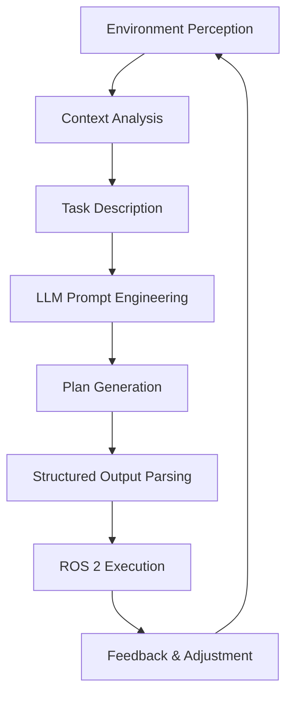

# LLM-Based Cognitive Planning with ROS 2

## Learning Objectives

By the end of this chapter, students should be able to:

- Understand LLM fundamentals and their role in robotics planning
- Design effective prompts for robotic task generation
- Implement structured output formatting for action sequences
- Create context-aware planning systems
- Integrate LLM planning with ROS 2 execution nodes
- Handle errors and edge cases in LLM-based systems
- Evaluate ethical considerations in AI planning

## Introduction to LLM-Based Cognitive Planning

Large Language Models (LLMs) are transforming robotic cognitive planning by enabling natural language understanding, complex reasoning, and adaptive decision-making. This chapter explores how to leverage LLMs for robotic task planning and execution.

### The Cognitive Planning Pipeline



**Key Components:**
- **Environment Perception**: Gathering contextual information
- **Task Analysis**: Understanding the goal and constraints
- **Prompt Engineering**: Crafting effective LLM inputs
- **Plan Generation**: Creating action sequences
- **Output Parsing**: Extracting executable commands
- **ROS 2 Integration**: Executing the plan
- **Feedback Loop**: Adjusting based on results

## LLM Fundamentals for Robotics

### How LLMs Work

LLMs are transformer-based neural networks trained on vast amounts of text data:

- **Tokenization**: Breaking text into meaningful units
- **Attention Mechanisms**: Understanding context and relationships
- **Next-Token Prediction**: Generating coherent responses
- **Fine-Tuning**: Adapting to specific domains

### LLM Capabilities for Robotics

| Capability | Robotic Application |
|------------|-------------------|
| Natural Language Understanding | Interpreting human commands |
| Reasoning | Planning complex tasks |
| Knowledge Retrieval | Accessing domain knowledge |
| Code Generation | Creating control scripts |
| Adaptation | Adjusting to new situations |

### Popular LLMs for Robotics

| Model | Provider | Strengths | Limitations |
|-------|----------|-----------|-------------|
| GPT-4 | OpenAI | General knowledge, reasoning | Cost, latency |
| Claude | Anthropic | Safety, structured output | Limited robotics focus |
| Llama 2 | Meta | Open-source, customizable | Smaller context window |
| Gemini | Google | Multimodal capabilities | Newer, less tested |
| Mistral | Mistral AI | Open-source, efficient | Smaller scale |

## Prompt Engineering for Robotic Planning

### Effective Prompt Structure

```
[System Message] - Sets context and role
[Task Description] - Clear objective
[Constraints] - Environmental limits
[Examples] - Few-shot learning
[Output Format] - Structured response
```

### Basic Planning Prompt Example

```python
system_message = """
You are an AI robotic planner for a humanoid robot.
Your task is to generate safe, efficient action sequences.
Always consider robot capabilities and environmental constraints.
"""

user_prompt = f"""
Current Environment:
- Location: Kitchen
- Objects: Fridge (open), table, chair, apple on table
- Robot Position: Near fridge
- Robot Capabilities: Can walk, grasp objects up to 2kg, open/close doors

Task: Bring me an apple from the fridge

Constraints:
- Maximum 3 steps
- Avoid obstacles
- Use both hands for fragile items

Generate a step-by-step action plan in JSON format:
{{
  "steps": [
    {{
      "action": "string",
      "parameters": {{}},
      "safety_check": "string"
    }}
  ],
  "estimated_time": "string",
  "safety_considerations": ["string"]
}}
"""
```

### Advanced Prompt Techniques

1. **Chain-of-Thought (CoT)**: "Think step by step"
2. **Few-Shot Learning**: Provide examples
3. **Role Specification**: "Act as a robotic planner"
4. **Constraint Enforcement**: "Never exceed weight limits"
5. **Output Formatting**: "Respond only in JSON format"

## Structured Output Formatting

### JSON Schema for Robotic Plans

```json
{
  "plan_id": "unique_identifier",
  "task": "description_of_task",
  "environment": {
    "location": "string",
    "objects": ["string"],
    "hazards": ["string"]
  },
  "steps": [
    {
      "step_id": "number",
      "action": "string",
      "target": "string",
      "parameters": {
        "distance": "number",
        "speed": "number",
        "force": "number"
      },
      "preconditions": ["string"],
      "postconditions": ["string"],
      "safety_check": "string",
      "fallback": "string"
    }
  ],
  "estimated_duration": "string",
  "success_criteria": ["string"],
  "failure_modes": ["string"],
  "safety_considerations": ["string"]
}
```

### Python Implementation

```python
import json
from typing import Dict, List

def validate_plan_structure(plan: Dict) -> bool:
    """Validate that the plan follows the expected structure"""

    required_fields = ['plan_id', 'task', 'environment', 'steps']

    # Check top-level fields
    if not all(field in plan for field in required_fields):
        return False

    # Check steps structure
    for step in plan['steps']:
        step_required = ['step_id', 'action', 'parameters', 'safety_check']
        if not all(field in step for field in step_required):
            return False

    return True

def parse_llm_output(llm_response: str) -> Dict:
    """Parse LLM response into structured plan"""
    try:
        # Clean and parse JSON
        plan = json.loads(llm_response)

        if validate_plan_structure(plan):
            return plan
        else:
            raise ValueError("Invalid plan structure")

    except json.JSONDecodeError:
        # Try to extract JSON from response
        start = llm_response.find('{')
        end = llm_response.rfind('}') + 1
        if start != -1 and end != -1:
            return parse_llm_output(llm_response[start:end])
        raise ValueError("Could not parse LLM output")
```

## Task Decomposition Strategies

### Hierarchical Task Decomposition

```
High-Level Task: "Prepare breakfast"
├── Subtask 1: "Get ingredients"
│   ├── Action 1: "Open fridge"
│   ├── Action 2: "Retrieve eggs"
│   └── Action 3: "Close fridge"
├── Subtask 2: "Cook eggs"
│   ├── Action 1: "Turn on stove"
│   ├── Action 2: "Place pan on stove"
│   └── Action 3: "Crack eggs into pan"
└── Subtask 3: "Serve breakfast"
    ├── Action 1: "Place eggs on plate"
    └── Action 2: "Bring plate to table"
```

### Implementation Example

```python
def decompose_task(task: str, max_depth: int = 3) -> List[Dict]:
    """Decompose a high-level task into subtasks"""

    if max_depth <= 0:
        return [{'action': task, 'subtasks': []}]

    # This would call the LLM with a decomposition prompt
    prompt = f"""
    Decompose this task into 2-4 logical subtasks:
    Task: {task}

    Respond in JSON format:
    {{
      "subtasks": [
        {{
          "description": "string",
          "dependencies": ["string"],
          "estimated_time": "string"
        }}
      ]
    }}
    """

    # llm_response = call_llm_api(prompt)
    # subtasks = parse_llm_output(llm_response)

    # For this example, return mock data
    return [
        {
            'action': f"Subtask 1 of {task}",
            'subtasks': decompose_task(f"Subtask 1 of {task}", max_depth - 1)
        },
        {
            'action': f"Subtask 2 of {task}",
            'subtasks': decompose_task(f"Subtask 2 of {task}", max_depth - 1)
        }
    ]
```

## Context Incorporation

### Environmental Context Types

1. **Spatial Context**: Object locations, distances
2. **Temporal Context**: Time of day, task duration
3. **Social Context**: Human presence, interactions
4. **Physical Context**: Surface types, weights, fragility
5. **Safety Context**: Hazards, emergency conditions

### Context Integration Example

```python
def build_context_prompt(environment_data: Dict) -> str:
    """Build a context-rich prompt for the LLM"""

    context = f"""
    Current Context:
    - Time: {environment_data.get('time', 'unknown')}
    - Location: {environment_data.get('location', 'unknown')}
    - Nearby Objects: {', '.join(environment_data.get('objects', []))}
    - Nearby Humans: {', '.join(environment_data.get('humans', []))}
    - Surface Conditions: {environment_data.get('surface', 'unknown')}
    - Lighting: {environment_data.get('lighting', 'unknown')}
    - Temperature: {environment_data.get('temperature', 'unknown')}°C
    - Battery Level: {environment_data.get('battery', 'unknown')}%
    - Current Task Progress: {environment_data.get('task_progress', 'none')}

    Robot Capabilities:
    - Maximum Speed: {environment_data.get('max_speed', 'unknown')} m/s
    - Maximum Load: {environment_data.get('max_load', 'unknown')} kg
    - Reach: {environment_data.get('reach', 'unknown')} cm
    - Sensors: {', '.join(environment_data.get('sensors', []))}
    - Current End Effector: {environment_data.get('end_effector', 'none')}
    """

    return context
```

## Adaptive Planning Techniques

### Dynamic Plan Adjustment

```python
class AdaptivePlanner:
    def __init__(self):
        self.current_plan = None
        self.execution_history = []
        self.environment_changes = []

    def adjust_plan(self, new_context: Dict) -> Dict:
        """Adjust the current plan based on new context"""

        # Analyze changes
        changes = self._detect_changes(new_context)

        if not changes:
            return self.current_plan

        # Generate adjustment prompt
        prompt = f"""
        Current Plan: {json.dumps(self.current_plan)}

        Context Changes:
        {json.dumps(changes)}

        Adjust the plan to accommodate these changes.
        Maintain the same JSON structure.
        Only modify steps that are directly affected.
        """

        # llm_response = call_llm_api(prompt)
        # adjusted_plan = parse_llm_output(llm_response)

        # For this example, return a modified version
        adjusted_plan = self.current_plan.copy()
        adjusted_plan['adjustments'] = changes

        return adjusted_plan

    def _detect_changes(self, new_context: Dict) -> Dict:
        """Detect significant changes in context"""
        changes = {}

        # Compare with previous context
        if hasattr(self, 'previous_context'):
            for key, new_value in new_context.items():
                old_value = self.previous_context.get(key)
                if new_value != old_value:
                    changes[key] = {
                        'old': old_value,
                        'new': new_value
                    }

        self.previous_context = new_context
        return changes
```

## ROS 2 Plan Execution

### ROS 2 Action Node Implementation

```python
#!/usr/bin/env python3
import rclpy
from rclpy.action import ActionServer
from rclpy.node import Node
from custom_interfaces.action import ExecutePlan
import json

class PlanExecutionNode(Node):
    def __init__(self):
        super().__init__('plan_execution_node')
        self._action_server = ActionServer(
            self,
            ExecutePlan,
            'execute_plan',
            self.execute_callback
        )

        # Plan execution state
        self.current_plan = None
        self.current_step = 0

    def execute_callback(self, goal_handle):
        feedback_msg = ExecutePlan.Feedback()
        result = ExecutePlan.Result()

        try:
            # Parse the plan
            self.current_plan = json.loads(goal_handle.request.plan)
            self.current_step = 0

            # Execute each step
            for step in self.current_plan['steps']:
                self.current_step += 1

                # Execute the step (this would call appropriate ROS 2 services)
                success = self._execute_step(step)

                if not success:
                    raise Exception(f"Step {step['step_id']} failed")

                # Update feedback
                feedback_msg.progress = f"Completed step {self.current_step}/{len(self.current_plan['steps'])}"
                goal_handle.publish_feedback(feedback_msg)

            # Plan completed successfully
            goal_handle.succeed()
            result.success = True
            result.message = "Plan executed successfully"

        except Exception as e:
            goal_handle.abort()
            result.success = False
            result.message = f"Plan execution failed: {str(e)}"

        return result

    def _execute_step(self, step: Dict) -> bool:
        """Execute a single step of the plan"""
        # This would call appropriate ROS 2 services based on step['action']
        self.get_logger().info(f"Executing step: {step['action']}")

        # Simulate execution with safety check
        if 'safety_check' in step and step['safety_check'] == 'fail':
            return False

        return True

def main(args=None):
    rclpy.init(args=args)
    executor = PlanExecutionNode()
    rclpy.spin(executor)

if __name__ == '__main__':
    main()
```

### ROS 2 Plan Client Implementation

```python
#!/usr/bin/env python3
import rclpy
from rclpy.action import ActionClient
from rclpy.node import Node
from custom_interfaces.action import ExecutePlan
import json

class PlanClient(Node):
    def __init__(self):
        super().__init__('plan_client')
        self._action_client = ActionClient(self, ExecutePlan, 'execute_plan')

    def execute_plan(self, plan: Dict):
        goal_msg = ExecutePlan.Goal()
        goal_msg.plan = json.dumps(plan)

        self._action_client.wait_for_server()
        self._send_goal_future = self._action_client.send_goal_async(goal_msg)
        self._send_goal_future.add_done_callback(self.goal_response_callback)

    def goal_response_callback(self, future):
        goal_handle = future.result()
        if not goal_handle.accepted:
            self.get_logger().info('Plan rejected')
            return

        self.get_logger().info('Plan accepted - executing')
        self._get_result_future = goal_handle.get_result_async()
        self._get_result_future.add_done_callback(self.get_result_callback)

    def get_result_callback(self, future):
        result = future.result().result
        self.get_logger().info(f'Plan execution result: {result.message}')
        rclpy.shutdown()

def main(args=None):
    rclpy.init(args=args)

    # Example plan
    example_plan = {
        "plan_id": "test_plan_001",
        "task": "Simple navigation test",
        "steps": [
            {
                "step_id": 1,
                "action": "move_forward",
                "parameters": {"distance": 0.5, "speed": 0.2},
                "safety_check": "clear_path"
            },
            {
                "step_id": 2,
                "action": "rotate",
                "parameters": {"angle": 90, "direction": "left"},
                "safety_check": "clear_space"
            }
        ]
    }

    client = PlanClient()
    client.execute_plan(example_plan)
    rclpy.spin(client)

if __name__ == '__main__':
    main()
```

## Feedback Loop Integration

### Continuous Plan Monitoring

```python
class PlanMonitor:
    def __init__(self):
        self.metrics = {
            'success_rate': 0,
            'completion_time': 0,
            'adjustments_made': 0,
            'errors_encountered': 0
        }

    def monitor_execution(self, plan: Dict, execution_results: List[Dict]) -> Dict:
        """Monitor plan execution and generate feedback"""

        feedback = {
            'plan_id': plan['plan_id'],
            'overall_success': all(r['success'] for r in execution_results),
            'step_results': [],
            'recommendations': []
        }

        # Analyze each step
        for i, (step, result) in enumerate(zip(plan['steps'], execution_results)):
            step_feedback = {
                'step_id': step['step_id'],
                'success': result['success'],
                'execution_time': result.get('time', 0),
                'issues': result.get('issues', [])
            }

            if not result['success']:
                step_feedback['recommendation'] = self._generate_recommendation(step, result)

            feedback['step_results'].append(step_feedback)

        # Generate overall recommendations
        if not feedback['overall_success']:
            feedback['recommendations'] = self._generate_overall_recommendations(feedback)

        return feedback

    def _generate_recommendation(self, step: Dict, result: Dict) -> str:
        """Generate specific recommendations for failed steps"""

        if 'obstacle_detected' in result.get('issues', []):
            return "Consider alternative path or obstacle avoidance strategy"

        if 'grip_failed' in result.get('issues', []):
            return "Check gripper calibration or object weight limits"

        return "Review step parameters and environmental conditions"

    def _generate_overall_recommendations(self, feedback: Dict) -> List[str]:
        """Generate high-level recommendations"""

        recommendations = []

        # Analyze failure patterns
        failed_steps = [s for s in feedback['step_results'] if not s['success']]

        if len(failed_steps) > 2:
            recommendations.append("Consider breaking plan into smaller, simpler steps")

        if any('navigation' in s.get('recommendation', '') for s in failed_steps):
            recommendations.append("Review navigation parameters and obstacle detection")

        return recommendations
```

## Practical Exercises

### Exercise 1: Basic LLM Planning

**Objective**: Create a simple LLM-based planner for a navigation task

1. Set up API access to an LLM provider
2. Design a prompt for a simple navigation task
3. Implement JSON output parsing
4. Create a basic plan validation function
5. Test with different navigation scenarios

**Success Criteria**:
- System generates valid navigation plans
- Plans follow the required JSON structure
- Basic validation works correctly

### Exercise 2: Context-Aware Planning

**Objective**: Implement a context-aware planning system

1. Create a context collection function
2. Design prompts that incorporate environmental data
3. Implement plan adjustment based on context changes
4. Test with simulated environment changes
5. Add safety checks to the planning process

**Success Criteria**:
- System adapts plans to context changes
- Safety considerations are properly handled
- Plans remain executable after adjustments

### Exercise 3: ROS 2 Integration

**Objective**: Connect LLM planning to ROS 2 execution

1. Create the ExecutePlan action interface
2. Implement the plan execution node
3. Create a client that sends LLM-generated plans
4. Test with a simulated robot environment
5. Add monitoring and feedback

**Success Criteria**:
- LLM-generated plans execute via ROS 2
- System provides execution feedback
- Error handling works for invalid plans

## Performance Benchmarking

### Planning System Metrics

| Metric | Target Value | Measurement Method |
|--------|--------------|-------------------|
| Plan Generation Time | &lt;5 seconds | Time from prompt to response |
| Success Rate | >90% | Percentage of executable plans |
| Context Adaptation | &lt;2 seconds | Time to adjust to changes |
| Memory Usage | &lt;500MB | Peak memory during planning |
| Step Accuracy | >95% | Percentage of correct steps |

### Benchmarking Implementation

```python
import time
import tracemalloc
from typing import Callable

def benchmark_planning_function(func: Callable, *args, **kwargs) -> Dict:
    """Benchmark a planning function"""

    # Start memory tracking
    tracemalloc.start()

    # Time execution
    start_time = time.time()
    result = func(*args, **kwargs)
    end_time = time.time()

    # Get memory usage
    current, peak = tracemalloc.get_traced_memory()
    tracemalloc.stop()

    return {
        'execution_time': end_time - start_time,
        'memory_current': current / 1024 / 1024,  # MB
        'memory_peak': peak / 1024 / 1024,      # MB
        'result': result
    }

# Example usage
benchmark_result = benchmark_planning_function(generate_plan, task_description, context)
print(f"Execution time: {benchmark_result['execution_time']:.2f}s")
print(f"Peak memory: {benchmark_result['memory_peak']:.2f}MB")
```

## Ethical Considerations

### AI Planning Ethics Framework

1. **Transparency**: Explain how plans are generated
2. **Accountability**: Clear responsibility for outcomes
3. **Safety**: Prioritize human and robot safety
4. **Fairness**: Avoid biased decision-making
5. **Privacy**: Protect sensitive environmental data
6. **Consent**: Inform users about AI involvement

### Ethical Implementation Checklist

```python
def ethical_plan_check(plan: Dict, context: Dict) -> Dict:
    """Check a plan for ethical considerations"""

    ethical_issues = []

    # Check for privacy concerns
    if 'camera_data' in context and 'human_presence' in context:
        ethical_issues.append({
            'type': 'privacy',
            'description': 'Plan involves processing data with humans present',
            'severity': 'medium',
            'recommendation': 'Anonymize or avoid capturing human data'
        })

    # Check for safety concerns
    for step in plan['steps']:
        if step['action'] in ['move_fast', 'forceful_grip']:
            ethical_issues.append({
                'type': 'safety',
                'description': f"Potentially unsafe action: {step['action']}",
                'severity': 'high',
                'step_id': step['step_id'],
                'recommendation': 'Add safety checks or reduce speed/force'
            })

    # Check for fairness/bias
    if 'object_recognition' in context and context['lighting'] == 'low':
        ethical_issues.append({
            'type': 'fairness',
            'description': 'Low lighting may affect object recognition accuracy',
            'severity': 'low',
            'recommendation': 'Add confirmation step or improve lighting'
        })

    return {
        'plan_id': plan['plan_id'],
        'ethical_issues_found': len(ethical_issues) > 0,
        'issues': ethical_issues,
        'ethical_score': max(0, 10 - len(ethical_issues))  # Simple scoring
    }
```

## Error Handling and Recovery

### Common LLM Planning Errors

| Error Type | Cause | Solution |
|------------|-------|----------|
| Invalid JSON | LLM output formatting | Parse with error correction |
| Hallucination | LLM invents facts | Add validation checks |
| Context Overflow | Too much context | Summarize or filter context |
| Rate Limiting | API call limits | Implement retry logic |
| Network Issues | API connectivity | Add offline fallback |

### Comprehensive Error Handling

```python
class LLMPlanner:
    def __init__(self, api_key: str, max_retries: int = 3):
        self.api_key = api_key
        self.max_retries = max_retries
        self.fallback_plans = {}

    def generate_plan(self, prompt: str) -> Dict:
        """Generate a plan with comprehensive error handling"""

        for attempt in range(self.max_retries):
            try:
                # Call LLM API
                response = self._call_llm_api(prompt)

                # Parse response
                plan = self._parse_response(response)

                # Validate plan
                if self._validate_plan(plan):
                    return plan
                else:
                    raise ValueError("Invalid plan structure")

            except Exception as e:
                self._handle_error(e, attempt)

                # Try fallback if available
                fallback = self._get_fallback_plan(prompt)
                if fallback:
                    return fallback

        raise Exception(f"Failed to generate plan after {self.max_retries} attempts")

    def _handle_error(self, error: Exception, attempt: int):
        """Handle different types of errors"""

        error_type = type(error).__name__

        if error_type == 'JSONDecodeError':
            self._log_error(f"JSON parsing error (attempt {attempt + 1}): {str(error)}")

        elif error_type == 'ValueError':
            self._log_error(f"Validation error (attempt {attempt + 1}): {str(error)}")

        elif 'RateLimit' in error_type:
            self._log_error(f"Rate limit exceeded (attempt {attempt + 1})")
            time.sleep(2 ** attempt)  # Exponential backoff

        else:
            self._log_error(f"Unexpected error (attempt {attempt + 1}): {str(error)}")

    def _get_fallback_plan(self, prompt: str) -> Optional[Dict]:
        """Get a fallback plan if available"""

        # This could be a simpler rule-based planner
        # or a cached plan for common tasks

        task_hash = hash(prompt)
        return self.fallback_plans.get(task_hash, None)
```

## Assessment Rubric

### LLM Cognitive Planning Assessment

| Criteria | Excellent (4-5 pts) | Good (2-3 pts) | Needs Improvement (0-1 pts) |
|----------|---------------------|----------------|----------------------------|
| **Prompt Design** | Clear, effective prompts | Basic prompts work | Poorly structured prompts |
| **Plan Generation** | Robust, context-aware plans | Basic plans work | Limited plan quality |
| **Structured Output** | Perfect JSON formatting | Mostly correct format | Frequent formatting errors |
| **ROS 2 Integration** | Full integration, proper error handling | Basic integration works | No ROS 2 connection |
| **Ethical Considerations** | Comprehensive ethical checks | Basic ethical awareness | No ethical considerations |

**Total Points**: 25 (5 criteria × 5 points each)

## References and Resources

### LLM Resources

- [OpenAI API Documentation](https://platform.openai.com/docs/api-reference)
- [Anthropic Claude Documentation](https://docs.anthropic.com/claude/docs)
- [HuggingFace Transformers](https://huggingface.co/docs/transformers/index)
- [LLM University](https://university.anthropic.com/)

### ROS 2 Resources

- [ROS 2 Actions](https://docs.ros.org/en/rolling/Tutorials/Understanding-ROS2-Actions.html)
- [rclpy Documentation](https://docs.ros2.org/latest/api/rclpy/)
- [ROS 2 Design Patterns](https://design.ros2.org/)

### Cognitive Planning Resources

- [AI Planning in Robotics](https://planning.wiki/)
- [PDDL (Planning Domain Definition Language)](https://planning.wiki/ref/pddl)
- [Hierarchical Task Networks](https://www.cs.cmu.edu/~softagents/htn.html)

### Ethical AI Resources

- [Partnership on AI](https://partnershiponai.org/)
- [AI Ethics Guidelines](https://www.oecd.org/going-digital/ai/principles/)
- [Responsible AI Practices](https://www.microsoft.com/en-us/ai/responsible-ai)