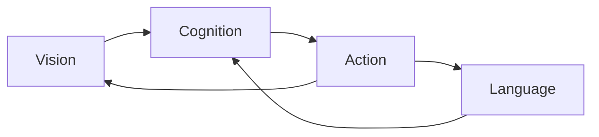
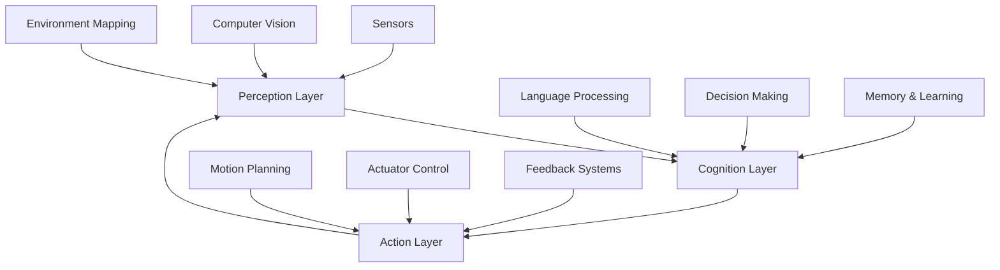
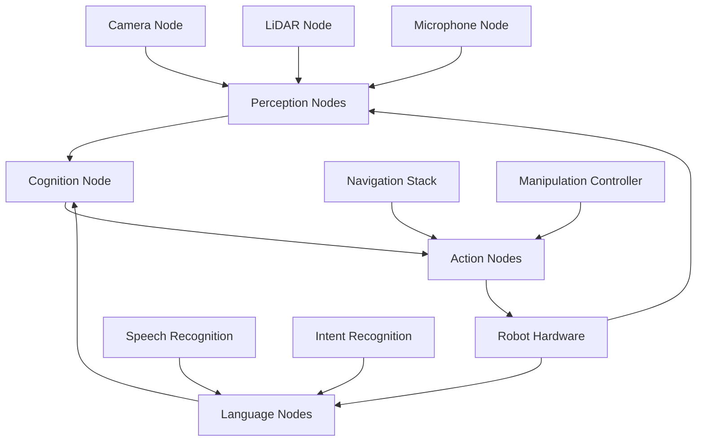
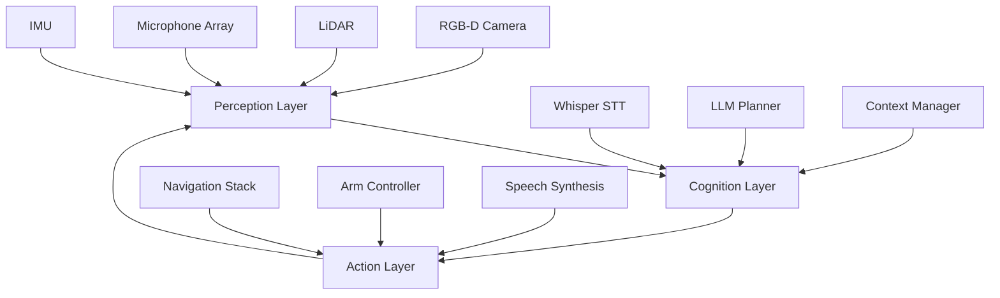

# Vision-Language-Action Foundations

## Learning Objectives

By the end of this chapter, students should be able to:

- Explain the fundamental concepts of Vision-Language-Action (VLA) systems
- Describe the architecture and components of VLA systems in robotics
- Understand how perception, cognition, and action integrate in autonomous systems
- Identify key challenges and opportunities in VLA system design
- Apply VLA principles to design basic robotic systems

## Introduction to Vision-Language-Action Systems

Vision-Language-Action (VLA) systems represent the cutting edge of autonomous robotics, integrating three critical capabilities:

1. **Vision**: Perceiving and understanding the environment through sensors
2. **Language**: Processing and generating human-like communication
3. **Action**: Executing physical movements and manipulations

### The VLA Paradigm



**Key Characteristics of VLA Systems:**

- **Multimodal Integration**: Combining visual, linguistic, and sensory data
- **Contextual Understanding**: Interpreting information in environmental context
- **Adaptive Behavior**: Adjusting actions based on real-time feedback
- **Human-Robot Interaction**: Natural communication interfaces
- **Autonomous Decision Making**: Independent planning and execution

### Applications in Robotics

**Service Robotics:**
- Hospital assistance robots
- Customer service automation
- Elderly care and support

**Industrial Automation:**
- Intelligent manufacturing assistants
- Quality control with AI vision
- Autonomous material handling

**Research and Exploration:**
- Autonomous scientific exploration
- Search and rescue operations
- Space and underwater robotics

## VLA System Architecture

### Core Components



### Perception Layer

**Sensors and Data Acquisition:**

| Sensor Type | Function | Example Applications |
|-------------|----------|---------------------|
| **RGB Cameras** | Visual scene capture | Object recognition, navigation |
| **Depth Sensors** | 3D environment mapping | Obstacle avoidance, manipulation |
| **LiDAR** | High-precision mapping | Autonomous navigation, SLAM |
| **Microphones** | Audio capture | Voice commands, sound localization |
| **IMU** | Motion sensing | Pose estimation, stabilization |
| **Tactile Sensors** | Touch feedback | Object manipulation, grasping |

**Computer Vision Techniques:**

- **Object Detection**: YOLO, Faster R-CNN, SSD
- **Semantic Segmentation**: U-Net, Mask R-CNN
- **Depth Estimation**: Stereo vision, monocular depth
- **Visual SLAM**: ORB-SLAM, LSD-SLAM
- **Pose Estimation**: OpenPose, MediaPipe

### Cognition Layer

**Language Processing:**

```python
# Example: Simple intent recognition
import re

def recognize_intent(command):
    """
    Recognize user intent from voice command

    Args:
        command (str): User voice command

    Returns:
        dict: Intent and entities
    """
    # Navigation patterns
    nav_patterns = {
        'go_to': r'go to (\w+)',
        'move': r'move (left|right|forward|backward)',
        'turn': r'turn (left|right) (\d+) degrees'
    }

    # Manipulation patterns
    manip_patterns = {
        'pick_up': r'pick up (\w+)',
        'place': r'place (\w+) (on|in) (\w+)',
        'grab': r'grab (\w+)'
    }

    # Check navigation intents
    for intent, pattern in nav_patterns.items():
        match = re.search(pattern, command, re.IGNORECASE)
        if match:
            return {
                'intent': intent,
                'entities': match.groups(),
                'type': 'navigation'
            }

    # Check manipulation intents
    for intent, pattern in manip_patterns.items():
        match = re.search(pattern, command, re.IGNORECASE)
        if match:
            return {
                'intent': intent,
                'entities': match.groups(),
                'type': 'manipulation'
            }

    return {'intent': 'unknown', 'entities': [], 'type': 'unknown'}

# Example usage
command = "Go to the kitchen"
result = recognize_intent(command)
print(f"Intent: {result['intent']}")
print(f"Entities: {result['entities']}")
print(f"Type: {result['type']}")
```

**Decision Making Processes:**

1. **Reactive Decision Making**: Immediate response to stimuli
2. **Deliberative Decision Making**: Planning-based approaches
3. **Hybrid Architectures**: Combining reactive and deliberative

```python
# Example: Simple decision making
class DecisionMaker:
    def __init__(self):
        self.state = 'idle'
        self.goals = []
        self.environment = {}

    def update_environment(self, sensor_data):
        """Update environmental awareness"""
        self.environment.update(sensor_data)

    def set_goals(self, goals):
        """Set mission goals"""
        self.goals = goals

    def make_decision(self):
        """Make decision based on current state and goals"""
        if not self.goals:
            return {'action': 'wait', 'params': {}}

        current_goal = self.goals[0]

        # Simple decision logic
        if current_goal['type'] == 'navigation':
            return {
                'action': 'navigate',
                'params': {
                    'target': current_goal['target'],
                    'speed': 'normal'
                }
            }

        elif current_goal['type'] == 'manipulation':
            return {
                'action': 'manipulate',
                'params': {
                    'object': current_goal['object'],
                    'action': current_goal['action']
                }
            }

        return {'action': 'wait', 'params': {}}

# Example usage
decision_maker = DecisionMaker()
decision_maker.set_goals([
    {'type': 'navigation', 'target': 'kitchen'}
])
decision_maker.update_environment({
    'obstacles': [],
    'path_clear': True
})
decision = decision_maker.make_decision()
print(f"Decision: {decision}")
```

### Action Layer

**Motion Planning:**

- **Path Planning**: A*, RRT, PRM
- **Trajectory Optimization**: CHOMP, STOMP
- **Collision Avoidance**: Potential fields, velocity obstacles

```python
# Example: Simple A* path planning
import heapq

def heuristic(a, b):
    """Calculate Manhattan distance between two points"""
    return abs(a[0] - b[0]) + abs(a[1] - b[1])

def astar(grid, start, goal):
    """
    A* path finding algorithm

    Args:
        grid: 2D array representing environment
        start: (x, y) starting position
        goal: (x, y) target position

    Returns:
        list: Path from start to goal
    """
    neighbors = [(0, 1), (1, 0), (0, -1), (-1, 0)]  # 4-directional movement

    close_set = set()
    came_from = {}
    gscore = {start: 0}
    fscore = {start: heuristic(start, goal)}
    oheap = []

    heapq.heappush(oheap, (fscore[start], start))

    while oheap:
        current = heapq.heappop(oheap)[1]

        if current == goal:
            # Reconstruct path
            path = []
            while current in came_from:
                path.append(current)
                current = came_from[current]
            path.append(start)
            path.reverse()
            return path

        close_set.add(current)

        for i, j in neighbors:
            neighbor = current[0] + i, current[1] + j

            # Check if neighbor is valid
            if (0 <= neighbor[0] < len(grid) and
                0 <= neighbor[1] < len(grid[0]) and
                grid[neighbor[0]][neighbor[1]] == 0 and
                neighbor not in close_set):

                tentative_g_score = gscore[current] + 1

                if neighbor not in gscore or tentative_g_score < gscore[neighbor]:
                    came_from[neighbor] = current
                    gscore[neighbor] = tentative_g_score
                    fscore[neighbor] = tentative_g_score + heuristic(neighbor, goal)
                    heapq.heappush(oheap, (fscore[neighbor], neighbor))

    return []  # No path found

# Example usage
grid = [
    [0, 0, 0, 0, 0],
    [0, 1, 1, 0, 0],
    [0, 0, 0, 0, 0],
    [0, 1, 1, 1, 0],
    [0, 0, 0, 0, 0]
]

start = (0, 0)
goal = (4, 4)
path = astar(grid, start, goal)
print(f"Path found: {path}")
```

**Actuator Control:**

- **Motor Control**: PID controllers, trajectory following
- **Gripper Control**: Force control, adaptive grasping
- **Motion Primitives**: Pre-defined movement patterns

## ROS 2 Integration for VLA Systems

### ROS 2 Architecture for VLA



### Node Communication Patterns

**Topic-Based Communication:**

```python
# Example: Publishing perception data
import rclpy
from rclpy.node import Node
from sensor_msgs.msg import Image

class PerceptionPublisher(Node):
    def __init__(self):
        super().__init__('perception_publisher')
        self.publisher = self.create_publisher(Image, '/vla/perception/image', 10)
        self.timer = self.create_timer(0.1, self.publish_image)

    def publish_image(self):
        # Create and publish image message
        img_msg = Image()
        # ... populate message ...
        self.publisher.publish(img_msg)
        self.get_logger().info('Published perception image')

def main(args=None):
    rclpy.init(args=args)
    publisher = PerceptionPublisher()
    rclpy.spin(publisher)
    publisher.destroy_node()
    rclpy.shutdown()

if __name__ == '__main__':
    main()
```

**Service-Based Communication:**

```python
# Example: Language processing service
from example_interfaces.srv import ProcessCommand

class LanguageProcessor(Node):
    def __init__(self):
        super().__init__('language_processor')
        self.service = self.create_service(
            ProcessCommand,
            '/vla/language/process',
            self.process_command_callback
        )

    def process_command_callback(self, request, response):
        # Process natural language command
        intent = self.recognize_intent(request.command)

        response.success = True
        response.intent = intent['intent']
        response.entities = ', '.join(intent['entities'])
        response.action = intent['type']

        return response
```

**Action-Based Communication:**

```python
# Example: VLA action server
from rclpy.action import ActionServer
from example_interfaces.action import ExecuteVLA

class VLAActionServer(Node):
    def __init__(self):
        super().__init__('vla_action_server')
        self.action_server = ActionServer(
            self,
            ExecuteVLA,
            '/vla/execute',
            self.execute_callback
        )

    def execute_callback(self, goal_handle):
        # Execute VLA action sequence
        feedback_msg = ExecuteVLA.Feedback()
        result = ExecuteVLA.Result()

        # Process perception
        feedback_msg.status = 'Perceiving environment'
        goal_handle.publish_feedback(feedback_msg)

        # Process language
        feedback_msg.status = 'Processing command'
        goal_handle.publish_feedback(feedback_msg)

        # Execute action
        feedback_msg.status = 'Executing action'
        goal_handle.publish_feedback(feedback_msg)

        # Complete
        goal_handle.succeed()
        result.success = True
        result.message = 'VLA action completed'

        return result
```

### VLA System Integration Example

```python
# Complete VLA integration example
import rclpy
from rclpy.node import Node
from rclpy.action import ActionClient
from rclpy.callback_groups import ReentrantCallbackGroup

class VLAIntegration(Node):
    def __init__(self):
        super().__init__('vla_integration')

        # Callback group for multi-threaded execution
        self.callback_group = ReentrantCallbackGroup()

        # Perception subscribers
        self.create_subscription(
            Image,
            '/camera/color/image_raw',
            self.image_callback,
            10,
            callback_group=self.callback_group
        )

        # Language processing client
        self.language_client = self.create_client(
            ProcessCommand,
            '/vla/language/process',
            callback_group=self.callback_group
        )

        # Action execution client
        self.action_client = ActionClient(
            self,
            ExecuteVLA,
            '/vla/execute',
            callback_group=self.callback_group
        )

        self.get_logger().info('VLA Integration Node initialized')

    def image_callback(self, msg):
        """Process incoming images"""
        # Process image for object detection
        detections = self.detect_objects(msg)

        # Update environmental awareness
        self.update_environment(detections)

    def process_command(self, command):
        """Process voice command"""
        # Wait for language service
        while not self.language_client.wait_for_service(timeout_sec=1.0):
            self.get_logger().info('Language service not available')

        # Create request
        request = ProcessCommand.Request()
        request.command = command

        # Call service
        future = self.language_client.call_async(request)
        rclpy.spin_until_future_complete(self, future)

        return future.result()

    def execute_vla_action(self, command):
        """Execute complete VLA sequence"""
        # Process command
        language_result = self.process_command(command)

        if not language_result.success:
            return False

        # Execute action
        goal_msg = ExecuteVLA.Goal()
        goal_msg.command = command
        goal_msg.intent = language_result.intent

        self.action_client.wait_for_server()
        future = self.action_client.send_goal_async(goal_msg)

        rclpy.spin_until_future_complete(self, future)

        return future.result().success

def main(args=None):
    rclpy.init(args=args)

    try:
        vla_node = VLAIntegration()
        rclpy.spin(vla_node)
    except KeyboardInterrupt:
        pass
    finally:
        rclpy.shutdown()

if __name__ == '__main__':
    main()
```

## Practical Exercise: VLA System Design

### Exercise Instructions

**Objective**: Design a VLA system architecture for a specific robotics application

**Scenario**: Design a VLA system for a hospital assistance robot that can:
1. Navigate to patient rooms
2. Deliver medications and supplies
3. Respond to voice commands from staff
4. Provide information about patients and schedules

**Tasks**:

1. **Define System Requirements**:
   - List all functional requirements
   - Identify key performance metrics
   - Specify safety constraints

2. **Design Architecture**:
   - Create component diagram
   - Define data flow between components
   - Specify communication protocols

3. **Select Technologies**:
   - Choose perception sensors
   - Select language processing approach
   - Determine action execution methods

4. **Develop Integration Plan**:
   - ROS 2 node structure
   - Topic/service/action interfaces
   - Error handling strategies

### Solution Template

```markdown
## Hospital Assistance Robot VLA System Design

### 1. System Requirements

**Functional Requirements:**
- [ ] Navigate to specified locations using voice commands
- [ ] Recognize and respond to staff voice requests
- [ ] Deliver medications safely and accurately
- [ ] Provide patient information through natural language
- [ ] Avoid obstacles and navigate crowded hallways

**Performance Metrics:**
- Command recognition accuracy: 95%+
- Navigation success rate: 98%+
- Response time: < 2 seconds
- Battery life: 8+ hours continuous operation

**Safety Constraints:**
- Emergency stop within 0.5 seconds
- Obstacle detection range: 5 meters
- Maximum speed: 1.5 m/s
- Medication delivery verification

### 2. Architecture Design



**Data Flow:**
1. Audio → Whisper → Intent Recognition → Action Planning
2. Visual → Object Detection → Environment Mapping → Path Planning
3. Sensors → SLAM → Localization → Motion Control

### 3. Technology Selection

**Perception Sensors:**
- RGB-D Camera: Intel RealSense D435
- LiDAR: Velodyne VLP-16
- Microphone Array: 4-mic circular array
- IMU: Bosch BMI088

**Language Processing:**
- Speech Recognition: OpenAI Whisper (base model)
- Intent Recognition: Custom regex + keyword matching
- Language Generation: OpenAI GPT-3.5 (for information responses)

**Action Execution:**
- Navigation: ROS 2 Nav2 with D* Lite planner
- Manipulation: MoveIt 2 with custom gripper control
- Voice Synthesis: Amazon Polly

### 4. ROS 2 Integration Plan

**Node Structure:**
```
/assistance_robot
├── perception
│   ├── camera_node
│   ├── lidar_node
│   ├── microphone_node
│   └── slam_node
├── cognition
│   ├── speech_recognition
│   ├── intent_processing
│   ├── planning
│   └── context_manager
└── action
    ├── navigation
    ├── manipulation
    └── speech_synthesis
```

**Interfaces:**

**Topics:**
- `/perception/camera/image` (sensor_msgs/Image)
- `/perception/lidar/scan` (sensor_msgs/LaserScan)
- `/perception/audio` (audio_msgs/AudioData)
- `/cognition/intent` (std_msgs/String)
- `/action/navigation/goal` (geometry_msgs/PoseStamped)

**Services:**
- `/cognition/process_command` (ProcessCommand)
- `/action/execute_plan` (ExecutePlan)
- `/action/speak` (Speak)

**Actions:**
- `/action/navigate_to` (NavigateTo)
- `/action/deliver_medication` (DeliverMedication)
- `/action/provide_info` (ProvideInfo)

**Error Handling:**
- Timeout handling for all service calls
- Fallback behaviors for failed actions
- Emergency stop on critical failures
- Logging and monitoring for all operations
```

### Assessment Criteria

| Criteria | Excellent (90-100%) | Proficient (80-89%) | Developing (70-79%) | Needs Improvement (<70%) |
|----------|-------------------|-------------------|-------------------|-------------------|
| **Requirements Analysis** | Comprehensive requirements with measurable metrics | Good requirements with minor gaps | Basic requirements with significant gaps | Incomplete or unclear requirements |
| **Architecture Design** | Complete architecture with clear component interactions | Good design with minor connectivity issues | Basic design with significant gaps | Incomplete or incorrect architecture |
| **Technology Selection** | Appropriate technologies with clear justification | Good selection with minor issues | Basic selection with significant gaps | Inappropriate or unclear technology choices |
| **Integration Plan** | Complete ROS 2 integration with proper interfaces | Good integration with minor issues | Basic integration with significant gaps | Incomplete or incorrect integration |
| **Error Handling** | Comprehensive error handling and recovery | Basic error handling with minor gaps | Limited error handling | No or inadequate error handling |

### Verification Checklist

- [ ] All functional requirements are addressed
- [ ] Architecture diagram is complete and accurate
- [ ] Technology selections are justified
- [ ] ROS 2 integration plan is comprehensive
- [ ] Error handling strategies are included
- [ ] Safety constraints are addressed
- [ ] Performance metrics are specified

## Summary

This chapter provided a comprehensive introduction to Vision-Language-Action systems, covering the fundamental architecture, components, and integration patterns. Students learned about the three core layers (perception, cognition, action) and how they integrate in autonomous robotics systems. Practical examples demonstrated ROS 2 implementation patterns, and the exercise provided hands-on experience in designing a complete VLA system for a specific application.

### Key Takeaways

1. **VLA Systems** integrate vision, language, and action for autonomous behavior
2. **Modular Architecture** enables flexible system design and development
3. **ROS 2 Integration** provides robust communication patterns for VLA components
4. **System Design** requires careful consideration of requirements, architecture, and technology selection
5. **Error Handling** is critical for robust autonomous system operation

### Additional Resources

- [ROS 2 Documentation](https://docs.ros.org/en/humble/)
- [OpenAI Whisper](https://github.com/openai/whisper)
- [ROS 2 Navigation Stack](https://navigation.ros.org/)
- [MoveIt 2](https://moveit.ros.org/)
- [VLA Research Papers](https://ieeexplore.ieee.org/)

### Quiz Questions

1. **What are the three core components of a VLA system?**
   a) Vision, Language, Action
   b) Sensors, Processors, Actuators
   c) Input, Processing, Output
   d) Perception, Cognition, Execution

   *Answer: a) Vision, Language, Action*

2. **Which ROS 2 communication pattern is best for time-sensitive data?**
   a) Topics
   b) Services
   c) Actions
   d) Parameters

   *Answer: a) Topics*

3. **What is the primary advantage of modular VLA architecture?**
   a) Faster execution
   b) Easier development and maintenance
   c) Lower memory usage
   d) Better visual appearance

   *Answer: b) Easier development and maintenance*

4. **Which component handles decision making in VLA systems?**
   a) Perception Layer
   b) Cognition Layer
   c) Action Layer
   d) Sensor Layer

   *Answer: b) Cognition Layer*

5. **What does SLAM stand for in robotics?**
   a) Simultaneous Localization and Mapping
   b) Sensor Learning and Motion
   c) System Logic and Management
   d) Sequential Location and Movement

   *Answer: a) Simultaneous Localization and Mapping*