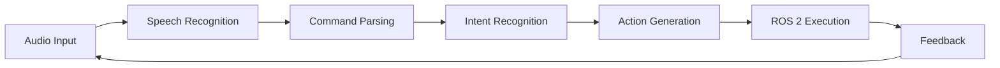

# Voice-to-Action with OpenAI Whisper

## Learning Objectives

By the end of this chapter, students should be able to:

- Understand the principles of speech recognition in robotics
- Implement OpenAI Whisper for voice command processing
- Design command parsing systems with intent recognition
- Integrate voice control with ROS 2 action servers
- Handle noise and errors in real-world voice systems
- Implement feedback mechanisms for command confirmation

## Introduction to Voice-to-Action Systems

Voice-to-Action (V2A) systems enable natural human-robot interaction by converting spoken commands into executable actions. This chapter focuses on implementing robust voice control systems using OpenAI Whisper and ROS 2.

### The Voice-to-Action Pipeline



**Key Components:**
- **Speech Recognition**: Converting audio to text (Whisper)
- **Command Parsing**: Extracting meaningful commands from text
- **Intent Recognition**: Understanding user intent
- **Action Generation**: Creating executable commands
- **ROS 2 Integration**: Executing actions on the robot
- **Feedback**: Confirming successful execution

## OpenAI Whisper: Speech Recognition

### Whisper Overview

OpenAI Whisper is a state-of-the-art automatic speech recognition (ASR) system that provides:

- **Multilingual support**: 99+ languages
- **High accuracy**: State-of-the-art performance
- **Robustness**: Handles accents, background noise
- **Accessibility**: Available as open-source model

### Whisper Installation

```bash
# Install Whisper and dependencies
pip install openai-whisper
pip install torch torchvision torchaudio

# For GPU acceleration (recommended)
pip install openai-whisper[gpu]
```

### Basic Whisper Usage

```python
import whisper

# Load the model (choose size based on your needs)
model = whisper.load_model("base")  # base, small, medium, large

# Transcribe audio from a file
audio_file = "command.wav"
result = model.transcribe(audio_file)

print(f"Detected language: {result['language']}")
print(f"Transcription: {result['text']}")
```

### Whisper Model Sizes

| Model Size | Parameters | Memory (VRAM) | Use Case |
|------------|------------|---------------|----------|
| `tiny` | 39M | ~1GB | Fast prototyping |
| `base` | 74M | ~1GB | General use |
| `small` | 244M | ~2GB | Better accuracy |
| `medium` | 769M | ~5GB | High accuracy |
| `large` | 1550M | ~10GB | Best accuracy |

**Recommendation**: Start with `base` model for educational purposes, use `medium` or `large` for production systems.

## Command Parsing and Intent Recognition

### Command Structure

Effective voice commands follow a structured pattern:

```
[Wake Word] [Action] [Target] [Parameters]
```

**Examples:**
- "Robot, move forward 50 centimeters"
- "Assistant, pick up the red block"
- "System, rotate left 90 degrees"

### Regex-Based Command Parsing

```python
import re

def parse_command(text):
    # Remove wake word
    text = re.sub(r'^(robot|assistant|system)[,:\s]+', '', text, flags=re.IGNORECASE)

    # Extract action and parameters
    patterns = {
        'move': r'(move|go|navigate)\s+(forward|backward|left|right)\s*(\d+)?\s*(cm|centimeters|meters)?',
        'rotate': r'(rotate|turn)\s+(left|right)\s*(\d+)?\s*(degrees)?',
        'pick': r'(pick|grab|take)\s+(up)?\s+(.+)'
    }

    for action, pattern in patterns.items():
        match = re.search(pattern, text, re.IGNORECASE)
        if match:
            return {
                'action': action,
                'parameters': match.groups(),
                'raw_text': text
            }

    return {'action': 'unknown', 'parameters': [], 'raw_text': text}

# Example usage
command_text = "Robot, move forward 50 centimeters"
parsed = parse_command(command_text)
print(f"Action: {parsed['action']}, Parameters: {parsed['parameters']}")
```

### Intent Recognition with Keywords

```python
def recognize_intent(text):
    # Clean and normalize text
    text = text.lower().strip()

    # Define intent keywords
    intents = {
        'navigation': ['move', 'go', 'navigate', 'forward', 'backward', 'left', 'right'],
        'manipulation': ['pick', 'grab', 'take', 'place', 'put', 'drop'],
        'rotation': ['rotate', 'turn', 'spin'],
        'query': ['what', 'where', 'how', 'status', 'position'],
        'emergency': ['stop', 'halt', 'emergency', 'abort']
    }

    # Check for intent matches
    for intent, keywords in intents.items():
        if any(keyword in text for keyword in keywords):
            return intent

    return 'unknown'
```

## Noise Reduction Techniques

### Audio Preprocessing

```python
import numpy as np
import noisereduce as nr
from scipy.io import wavfile

def reduce_noise(input_file, output_file):
    # Load audio file
    rate, data = wavfile.read(input_file)

    # Apply noise reduction
    reduced_noise = nr.reduce_noise(y=data, sr=rate)

    # Save processed audio
    wavfile.write(output_file, rate, reduced_noise.astype(np.int16))

    return output_file

# Usage
clean_audio = reduce_noise("noisy_command.wav", "clean_command.wav")
```

### Environment-Specific Strategies

1. **Acoustic Treatment**: Use sound-absorbing materials
2. **Directional Microphones**: Focus on speaker direction
3. **Audio Filtering**: Apply bandpass filters
4. **Multi-Microphone Arrays**: Use beamforming techniques
5. **Adaptive Thresholds**: Adjust based on ambient noise

## ROS 2 Integration

### ROS 2 Action Server Setup

```python
#!/usr/bin/env python3
import rclpy
from rclpy.action import ActionServer
from rclpy.node import Node
from custom_interfaces.action import VoiceCommand

class VoiceCommandServer(Node):
    def __init__(self):
        super().__init__('voice_command_server')
        self._action_server = ActionServer(
            self,
            VoiceCommand,
            'voice_command',
            self.execute_callback
        )

    def execute_callback(self, goal_handle):
        feedback_msg = VoiceCommand.Feedback()
        result = VoiceCommand.Result()

        # Process the voice command
        command = goal_handle.request.command
        feedback_msg.status = f"Processing: {command}"

        # Simulate execution
        self.get_logger().info(f"Executing: {command}")

        # Return success
        goal_handle.succeed()
        result.success = True
        result.message = f"Command '{command}' executed successfully"

        return result

def main(args=None):
    rclpy.init(args=args)
    server = VoiceCommandServer()
    rclpy.spin(server)

if __name__ == '__main__':
    main()
```

### ROS 2 Action Client Implementation

```python
#!/usr/bin/env python3
import rclpy
from rclpy.action import ActionClient
from rclpy.node import Node
from custom_interfaces.action import VoiceCommand

class VoiceCommandClient(Node):
    def __init__(self):
        super().__init__('voice_command_client')
        self._action_client = ActionClient(self, VoiceCommand, 'voice_command')

    def send_command(self, command):
        goal_msg = VoiceCommand.Goal()
        goal_msg.command = command

        self._action_client.wait_for_server()
        self._send_goal_future = self._action_client.send_goal_async(goal_msg)
        self._send_goal_future.add_done_callback(self.goal_response_callback)

    def goal_response_callback(self, future):
        goal_handle = future.result()
        if not goal_handle.accepted:
            self.get_logger().info('Goal rejected')
            return

        self.get_logger().info('Goal accepted')
        self._get_result_future = goal_handle.get_result_async()
        self._get_result_future.add_done_callback(self.get_result_callback)

    def get_result_callback(self, future):
        result = future.result().result
        self.get_logger().info(f'Result: {result.message}')
        rclpy.shutdown()

def main(args=None):
    rclpy.init(args=args)
    client = VoiceCommandClient()
    client.send_command("move forward 50 centimeters")
    rclpy.spin(client)

if __name__ == '__main__':
    main()
```

## Feedback Mechanisms

### Command Confirmation Strategies

1. **Audio Feedback**: "Command received: move forward 50 centimeters"
2. **Visual Feedback**: LED indicators or screen display
3. **Haptic Feedback**: Vibration patterns
4. **Status Updates**: Progress reporting during execution

### Implementation Example

```python
def provide_feedback(command, status):
    """Provide multi-modal feedback to user"""

    # Audio feedback
    if status == "received":
        speak(f"Command received: {command}")
    elif status == "executing":
        speak(f"Executing: {command}")
    elif status == "completed":
        speak(f"Completed: {command}")
    elif status == "error":
        speak(f"Error executing: {command}")

    # Visual feedback (ROS 2 service call)
    # This would call a visual feedback service

    # Log feedback
    log_feedback(command, status)
```

## Practical Exercises

### Exercise 1: Basic Voice Recognition

**Objective**: Implement a simple voice recognition system using Whisper

1. Install Whisper and dependencies
2. Record a test audio file with a simple command
3. Implement transcription using Whisper
4. Parse the command and extract action parameters
5. Print the parsed command structure

**Success Criteria**:
- System correctly transcribes spoken commands
- Command parsing extracts action and parameters
- Error handling for unrecognized commands

### Exercise 2: ROS 2 Integration

**Objective**: Connect voice commands to ROS 2 action server

1. Create a ROS 2 action interface for voice commands
2. Implement the action server
3. Create a client that sends parsed commands
4. Test with simulated robot movements
5. Add feedback mechanisms

**Success Criteria**:
- Voice commands trigger ROS 2 actions
- System provides appropriate feedback
- Error handling for failed executions

## Performance Optimization

### Whisper Performance Tips

1. **Model Selection**: Choose appropriate model size
2. **Batch Processing**: Process multiple commands together
3. **Caching**: Cache frequent command patterns
4. **Hardware Acceleration**: Use GPU when available
5. **Quantization**: Use smaller data types for inference

### Real-time Processing Strategies

```python
# Use streaming mode for real-time processing
import whisper
import pyaudio

model = whisper.load_model("base")

# Audio stream setup
p = pyaudio.PyAudio()
stream = p.open(format=pyaudio.paInt16,
                channels=1,
                rate=16000,
                input=True,
                frames_per_buffer=1024)

# Process audio chunks
while True:
    data = stream.read(1024)
    # Process data with Whisper
    # (Implementation would use streaming API)
```

## Troubleshooting Guide

### Common Issues and Solutions

| Issue | Cause | Solution |
|-------|-------|----------|
| Low accuracy | Background noise | Use noise reduction, directional mic |
| Slow processing | Large model | Use smaller model size |
| Command misinterpretation | Poor parsing | Improve regex patterns |
| ROS 2 connection failed | Network issues | Check ROS 2 network setup |
| Memory errors | Insufficient RAM | Reduce model size or use GPU |

### Debugging Checklist

1. ✅ Verify audio input device is working
2. ✅ Check Whisper model is properly loaded
3. ✅ Validate command parsing logic
4. ✅ Test ROS 2 action server independently
5. ✅ Check network connectivity for ROS 2
6. ✅ Monitor memory usage during processing

## Assessment Rubric

### Voice-to-Action Implementation Assessment

| Criteria | Excellent (4-5 pts) | Good (2-3 pts) | Needs Improvement (0-1 pts) |
|----------|---------------------|----------------|----------------------------|
| **Speech Recognition** | Accurate transcription, handles noise | Basic transcription works | Frequent errors, poor accuracy |
| **Command Parsing** | Robust parsing, handles variations | Basic parsing works | Limited command support |
| **ROS 2 Integration** | Full integration, proper feedback | Basic integration works | No ROS 2 connection |
| **Error Handling** | Comprehensive error handling | Basic error handling | No error handling |
| **Documentation** | Complete, clear documentation | Basic documentation | Missing or poor docs |

**Total Points**: 20 (4 criteria × 5 points each)

## Safety Considerations

### Voice Control Safety Protocols

1. **Emergency Stop**: Always include voice-activated emergency stop
2. **Command Confirmation**: Require confirmation for critical actions
3. **Speed Limits**: Enforce safe movement speeds
4. **Environment Awareness**: Check surroundings before movement
5. **Human Oversight**: Maintain manual override capability

### Ethical Voice System Design

- **Privacy**: Avoid storing sensitive voice data
- **Consent**: Inform users about voice recording
- **Bias Mitigation**: Test with diverse voices and accents
- **Accessibility**: Support users with speech impairments
- **Transparency**: Explain system limitations clearly

## References and Resources

### OpenAI Whisper Resources

- [Whisper GitHub Repository](https://github.com/openai/whisper)
- [Whisper Documentation](https://github.com/openai/whisper#readme)
- [Whisper Model Card](https://github.com/openai/whisper/blob/main/model-card.md)

### ROS 2 Resources

- [ROS 2 Documentation](https://docs.ros.org/en/rolling/)
- [ROS 2 Action Tutorial](https://docs.ros.org/en/rolling/Tutorials/Understanding-ROS2-Actions.html)
- [rclpy API Documentation](https://docs.ros2.org/latest/api/rclpy/)

### Additional Learning

- [Speech Recognition with Deep Learning](https://www.coursera.org/learn/speech-recognition)
- [Natural Language Processing Specialization](https://www.coursera.org/specializations/natural-language-processing)
- [ROS 2 for Robotics](https://www.udemy.com/course/ros2-for-beginners/)