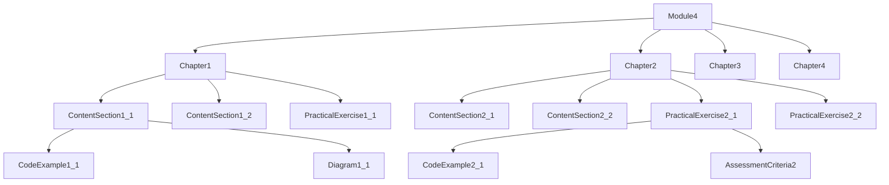
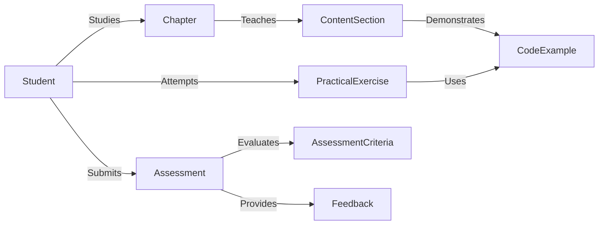

# Data Model: Vision-Language-Action (VLA) Module

**Created**: 2026-01-14
**Status**: Completed
**Purpose**: Content structure and data model for Module 4

## Content Entities

### 1. Chapter Entity

**Chapter** represents a major section of Module 4 with educational content and practical exercises.

**Attributes**:
- `id`: Unique identifier (1-4)
- `title`: Chapter title (string, 50-100 characters)
- `description`: Brief summary (string, 100-200 words)
- `priority`: Importance level (P1-P4)
- `learning_outcomes`: Array of specific learning objectives
- `prerequisites`: Array of required prior knowledge
- `content_sections`: Array of content sections
- `practical_exercises`: Array of hands-on exercises
- `assessment_criteria`: Evaluation rubric
- `estimated_duration`: Study time in hours

**Relationships**:
- Contains multiple `ContentSection` entities
- Contains multiple `PracticalExercise` entities
- References `AssessmentCriteria` entity

**Validation Rules**:
- Title must be unique within module
- Must have at least 3 learning outcomes
- Must include at least 2 practical exercises
- Estimated duration must be realistic (2-8 hours)

### 2. ContentSection Entity

**ContentSection** represents a thematic subsection within a chapter.

**Attributes**:
- `id`: Section identifier (e.g., "1.1", "2.3")
- `title`: Section title (string, 30-80 characters)
- `content`: Markdown content (string)
- `code_examples`: Array of code snippets
- `diagrams`: Array of diagram references
- `key_concepts`: Array of important terms
- `references`: Array of source citations

**Relationships**:
- Belongs to one `Chapter` entity
- May reference `CodeExample` entities
- May reference `Diagram` entities

**Validation Rules**:
- Content must be in valid Docusaurus Markdown format
- Code examples must be syntactically correct
- All references must be properly cited

### 3. PracticalExercise Entity

**PracticalExercise** represents a hands-on learning activity.

**Attributes**:
- `id`: Exercise identifier (e.g., "EX-2-1")
- `title`: Exercise title (string, 30-80 characters)
- `description`: Detailed instructions (string)
- `objectives`: Array of learning goals
- `requirements`: Array of prerequisites
- `step_by_step`: Array of implementation steps
- `verification_criteria`: Success conditions
- `solution_guide`: Reference implementation
- `estimated_time`: Duration in minutes
- `difficulty`: Level (beginner/intermediate/advanced)

**Relationships**:
- Belongs to one `Chapter` entity
- May reference `CodeExample` entities
- May reference external resources

**Validation Rules**:
- Must have clear verification criteria
- Solution guide must be complete and tested
- Estimated time must be accurate (±20%)

### 4. CodeExample Entity

**CodeExample** represents a runnable code demonstration.

**Attributes**:
- `id`: Unique identifier (e.g., "CODE-3-2")
- `title`: Brief description (string, 20-60 characters)
- `language`: Programming language (string)
- `code`: Source code (string)
- `explanation`: Purpose and key concepts (string)
- `dependencies`: Required libraries (array)
- `setup_instructions`: Environment setup (string)
- `expected_output`: Sample results (string)
- `is_runnable`: Boolean (can be executed as-is)

**Relationships**:
- Referenced by `ContentSection` or `PracticalExercise`
- May depend on other `CodeExample` entities

**Validation Rules**:
- Code must be syntactically valid
- Dependencies must be clearly specified
- If runnable, must include complete setup instructions

### 5. AssessmentCriteria Entity

**AssessmentCriteria** defines evaluation standards for student work.

**Attributes**:
- `chapter_id`: Associated chapter (1-4)
- `categories`: Array of assessment categories
- `weighting`: Category importance percentages
- `rubric`: Detailed evaluation matrix
- `performance_levels`: Array of grade descriptions
- `grading_scale`: Score to grade mapping

**Relationships**:
- Associated with one `Chapter` entity
- Used to evaluate `PracticalExercise` completions

**Validation Rules**:
- Weights must sum to 100%
- Rubric must be clear and measurable
- Must align with learning outcomes

## Content Structure Model



## Chapter Breakdown

### Chapter 1: Vision-Language-Action Foundations

**Entity Structure**:
```
Chapter1
├── ContentSection1_1: VLA Overview
│   ├── Key concepts: perception, cognition, action
│   ├── Historical context
│   └── Current applications
├── ContentSection1_2: System Architecture
│   ├── Component diagram
│   ├── Data flow analysis
│   └── Integration patterns
├── ContentSection1_3: ROS 2 Integration
│   ├── Node structure
│   ├── Topic communication
│   └── Service interfaces
└── PracticalExercise1_1: VLA System Design
    ├── Architecture diagram
    └── Component analysis
```

### Chapter 2: Voice-to-Action with OpenAI Whisper

**Entity Structure**:
```
Chapter2
├── ContentSection2_1: Speech Recognition
│   ├── Whisper architecture
│   ├── Model selection
│   └── Performance considerations
├── ContentSection2_2: Command Processing
│   ├── Intent recognition
│   ├── Entity extraction
│   └── Error handling
├── ContentSection2_3: ROS 2 Integration
│   ├── Action servers
│   └── Feedback mechanisms
├── PracticalExercise2_1: Basic Voice Control
│   ├── Whisper setup
│   └── Simple command execution
└── PracticalExercise2_2: Advanced Command Processing
    ├── Context-aware commands
    └── Multi-step sequences
```

### Chapter 3: LLM-Based Cognitive Planning

**Entity Structure**:
```
Chapter3
├── ContentSection3_1: LLM Fundamentals
│   ├── Model architectures
│   ├── Prompt engineering
│   └── Output formatting
├── ContentSection3_2: Planning Strategies
│   ├── Task decomposition
│   ├── Context incorporation
│   └── Adaptive planning
├── ContentSection3_3: ROS 2 Implementation
│   ├── Plan execution nodes
│   └── Feedback loops
├── PracticalExercise3_1: Basic Planning
│   ├── Simple task generation
│   └── Plan execution
└── PracticalExercise3_2: Context-Aware Planning
    ├── Environmental adaptation
    └── Dynamic replanning
```

### Chapter 4: Capstone - Autonomous Humanoid

**Entity Structure**:
```
Chapter4
├── ContentSection4_1: System Integration
│   ├── Architecture overview
│   ├── Component interfaces
│   └── Data flow
├── ContentSection4_2: Performance Optimization
│   ├── Latency reduction
│   ├── Resource management
│   └── Error recovery
├── ContentSection4_3: Safety Considerations
│   ├── Emergency protocols
│   └── Ethical guidelines
├── PracticalExercise4_1: Integration Project
│   ├── Component assembly
│   └── System testing
└── PracticalExercise4_2: Performance Tuning
    ├── Benchmarking
    └── Optimization
```

## Validation Rules

### Content Quality Rules

1. **Technical Accuracy**: All factual claims must be cited from reputable sources
2. **Code Quality**: All examples must be syntactically correct and follow best practices
3. **Pedagogical Value**: Content must progress from simple to complex concepts
4. **Completeness**: Each chapter must cover all specified learning outcomes
5. **Consistency**: Terminology and formatting must be uniform across module

### Structural Rules

1. **Chapter Organization**: Must follow priority order (P1-P4)
2. **Section Flow**: Concepts before implementation, theory before practice
3. **Exercise Placement**: Practical exercises must follow relevant theory
4. **Reference Integrity**: All cross-references must be valid
5. **Asset Organization**: Diagrams and code must be properly categorized

### Assessment Rules

1. **Alignment**: Assessment criteria must match learning outcomes
2. **Measurability**: All criteria must be objectively evaluable
3. **Fairness**: Rubrics must be clear and consistent
4. **Comprehensiveness**: Must cover all major concepts
5. **Transparency**: Students must understand evaluation standards

## Data Flow Model



## Implementation Guidelines

### Content Creation Workflow

1. **Outline Creation**: Define chapter structure and learning outcomes
2. **Theory Development**: Write foundational content with citations
3. **Example Development**: Create and test code examples
4. **Exercise Design**: Develop practical exercises with solutions
5. **Integration**: Combine all elements with proper cross-references
6. **Validation**: Verify technical accuracy and pedagogical value

### Quality Assurance Process

1. **Technical Review**: Verify code examples and factual accuracy
2. **Pedagogical Review**: Ensure logical progression and clarity
3. **Accessibility Review**: Check readability and format compliance
4. **Integration Testing**: Validate cross-references and navigation
5. **Performance Testing**: Verify build times and rendering

## Metadata Standards

### Chapter Metadata

```yaml
# Required for each chapter
id: 1-4
title: "Chapter Title"
description: "Brief summary"
priority: P1-P4
prerequisites: ["Module 1", "Module 2", "Module 3"]
learning_outcomes:
  - "Outcome 1"
  - "Outcome 2"
  - "Outcome 3"
estimated_duration: 4-6 hours
status: draft/ready/published
```

### Content Section Metadata

```yaml
# Required for each section
id: "chapter-section"
title: "Section Title"
dependencies: ["previous-section"]
key_concepts: ["concept1", "concept2"]
references:
  - "Source 1"
  - "Source 2"
```

### Exercise Metadata

```yaml
# Required for each exercise
difficulty: beginner/intermediate/advanced
estimated_time: 30-120 minutes
requirements:
  - "Prerequisite knowledge"
  - "Software dependencies"
verification:
  method: automatic/manual
  criteria: ["criterion1", "criterion2"]
```

## Version Control Strategy

### Content Versioning

- **Major versions**: Structural changes, significant content additions
- **Minor versions**: Content updates, example improvements
- **Patch versions**: Typo fixes, formatting corrections

### Branch Strategy

```
main → stable published content
dev → integration branch
feature/* → individual chapter development
docs/* → documentation improvements
```

### Change Management

1. **Content changes**: Require technical and pedagogical review
2. **Structural changes**: Require architecture approval
3. **Breaking changes**: Require deprecation notice and migration guide

This data model ensures consistent, high-quality educational content that meets the specification requirements while providing flexibility for future enhancements.