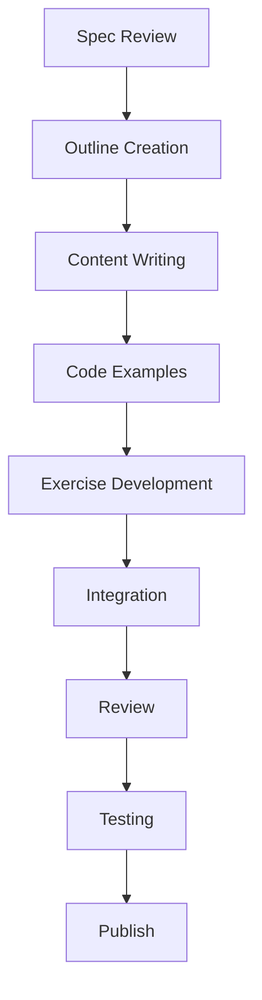

# Quickstart Guide: Vision-Language-Action (VLA) Module

**Created**: 2026-01-14
**Status**: Completed
**Purpose**: Get started with Module 4 development and usage

## For Developers: Setting Up Module 4

### Prerequisites

```bash
# Ensure you have the required tools installed
node --version  # Node.js 16+ required
npm --version   # npm 7+ required
python3 --version  # Python 3.8+ required
```

### Project Setup

```bash
# Clone the repository (if not already done)
git clone https://github.com/your-repo/book-hackathon.git
cd book-hackathon

# Install dependencies
npm install

# Verify Docusaurus installation
npx docusaurus --version
```

### Adding Module 4 Structure

```bash
# Create Module 4 directory structure
mkdir -p book_frontend/docs/module4/assets

# Create chapter files
touch book_frontend/docs/module4/1-vla-foundations.md
touch book_frontend/docs/module4/2-voice-to-action.md
touch book_frontend/docs/module4/3-llm-cognitive-planning.md
touch book_frontend/docs/module4/4-autonomous-humanoid.md
```

### Update Sidebar Navigation

Edit `book_frontend/sidebars.js`:

```javascript
// Add Module 4 to the sidebar
module.exports = {
  docs: [
    // ... existing modules
    {
      type: 'category',
      label: 'Module 4: Vision-Language-Action',
      items: [
        'module4/1-vla-foundations',
        'module4/2-voice-to-action',
        'module4/3-llm-cognitive-planning',
        'module4/4-autonomous-humanoid'
      ]
    }
  ]
}
```

### Run Development Server

```bash
# Start Docusaurus development server
npm run start

# Access the book at http://localhost:3000
```

## For Students: Using Module 4

### Getting Started with VLA

1. **Complete Prerequisites**:
   - Finish Modules 1-3
   - Set up ROS 2 environment
   - Install Python dependencies

2. **Install Required Packages**:

```bash
# Install Python packages
pip install openai-whisper transformers torch ros2cli

# For GPU acceleration (optional)
pip install torch-cuda
```

### Chapter 1: VLA Foundations

**Quick Tour**:
- Read the overview section first
- Study the architecture diagrams
- Try the system design exercise
- Review key concepts and terminology

**Time Estimate**: 4-6 hours

### Chapter 2: Voice-to-Action

**Quick Tour**:
- Start with Whisper installation guide
- Follow the basic voice control exercise
- Experiment with different voice commands
- Try the advanced command processing

**Time Estimate**: 6-8 hours

### Chapter 3: LLM Cognitive Planning

**Quick Tour**:
- Begin with prompt engineering basics
- Implement the basic planning exercise
- Explore context-aware planning
- Test different LLM models

**Time Estimate**: 8-10 hours

### Chapter 4: Autonomous Humanoid Capstone

**Quick Tour**:
- Review system integration patterns
- Start with the integration project
- Implement performance tuning
- Test the complete system

**Time Estimate**: 10-12 hours

## Development Workflow

### Content Creation Process



### Writing Guidelines

**Markdown Standards**:
```markdown
# Heading 1 (Chapter Title)

## Heading 2 (Section Title)

### Heading 3 (Subsection)

**Bold text** for important concepts

`code snippets` for inline code

```python
# Code blocks with language specification
import example
```

> **Note**: Use callouts for important information

- Use lists for step-by-step instructions
- Keep paragraphs concise (3-5 sentences)
```

### Code Example Standards

```python
# Required structure for all code examples
"""
Example Title: Brief description of what this demonstrates

Prerequisites:
- Package1 installed
- Package2 configured

Expected Output: Description of what should happen
"""

# Import required libraries
import library1
import library2

# Main implementation
def example_function():
    # Step 1: Setup
    # Step 2: Processing
    # Step 3: Return results
    return result

# Execution
if __name__ == "__main__":
    example_function()
```

### Exercise Development Standards

**Required Components**:
1. **Title**: Clear, descriptive name
2. **Objective**: Specific learning goal
3. **Prerequisites**: Required knowledge/software
4. **Instructions**: Step-by-step guide
5. **Verification**: Success criteria
6. **Solution**: Reference implementation
7. **Extension**: Optional challenges

**Example Structure**:
```markdown
## Exercise: Voice Command Processing

**Objective**: Implement a voice command system using Whisper and ROS 2

**Prerequisites**:
- ROS 2 installed
- Whisper setup complete
- Basic Python knowledge

**Instructions**:
1. Create a ROS 2 node for audio capture
2. Integrate Whisper for speech-to-text
3. Implement command parsing logic
4. Connect to ROS 2 action server

**Verification**:
- System recognizes 90% of test commands
- Commands execute appropriate actions
- Response time < 2 seconds

**Solution**: [Link to solution code]

**Extension**:
- Add noise reduction
- Implement multi-language support
```

## Testing and Validation

### Content Testing

```bash
# Test Docusaurus build
npm run build

# Check for broken links
npm run check-links

# Validate Markdown syntax
npm run lint:md
```

### Code Testing

```bash
# Test Python examples
python3 example.py

# Test ROS 2 nodes
ros2 run package node

# Run unit tests
pytest tests/
```

### Performance Testing

```bash
# Measure page load times
lighthouse http://localhost:3000

# Test search functionality
npm run test:search

# Validate accessibility
npm run test:accessibility
```

## Deployment Process

### Staging Deployment

```bash
# Build for staging
npm run build:staging

# Deploy to staging server
npm run deploy:staging

# Verify deployment
npm run verify:staging
```

### Production Deployment

```bash
# Build for production
npm run build:prod

# Deploy to production
npm run deploy:prod

# Verify deployment
npm run verify:prod

# Announce release
npm run announce
```

## Troubleshooting

### Common Issues

**Docusaurus Build Errors**:
```bash
# Clean build
rm -rf node_modules/.cache
npm run clean
npm install
npm run build
```

**Missing Dependencies**:
```bash
# Check Python packages
pip list

# Install missing packages
pip install missing-package
```

**ROS 2 Integration Issues**:
```bash
# Check ROS 2 environment
source /opt/ros/humble/setup.bash

# Verify node communication
ros2 topic list
ros2 node list
```

### Debugging Tools

```bash
# Docusaurus debugging
npm run debug

# Python debugging
python3 -m pdb script.py

# ROS 2 debugging
ros2 run rqt_console
ros2 run rqt_graph
```

## Best Practices

### Content Development

1. **Modular Approach**: Develop one chapter at a time
2. **Incremental Testing**: Test each section as you complete it
3. **Consistent Style**: Follow existing module patterns
4. **Accessibility**: Ensure all content is accessible
5. **Internationalization**: Use clear, simple language

### Code Development

1. **Error Handling**: Include proper error handling
2. **Documentation**: Comment all non-trivial code
3. **Testing**: Write tests for all examples
4. **Performance**: Optimize critical sections
5. **Security**: Follow best practices

### Collaboration

1. **Branch Strategy**: Use feature branches
2. **Pull Requests**: Get reviews before merging
3. **Code Reviews**: Be thorough but constructive
4. **Documentation**: Update docs with changes
5. **Communication**: Keep team informed

## Resources

### Documentation

- [Docusaurus Official Docs](https://docusaurus.io/docs)
- [ROS 2 Documentation](https://docs.ros.org)
- [OpenAI Whisper Docs](https://github.com/openai/whisper)
- [HuggingFace Transformers](https://huggingface.co/docs/transformers)

### Tools

- [Markdown Editor](https://stackedit.io)
- [Draw.io for Diagrams](https://draw.io)
- [Python Tutor](https://pythontutor.com)
- [ROS 2 Visualization](https://github.com/ros2/rqt)

### Community

- [ROS Discourse](https://discourse.ros.org)
- [Docusaurus GitHub](https://github.com/facebook/docusaurus)
- [Stack Overflow](https://stackoverflow.com)

## Checklist for Module Completion

### Content Checklist

- [ ] Chapter 1: VLA Foundations (complete)
- [ ] Chapter 2: Voice-to-Action (complete)
- [ ] Chapter 3: LLM Cognitive Planning (complete)
- [ ] Chapter 4: Autonomous Humanoid (complete)
- [ ] All code examples tested
- [ ] All exercises have solutions
- [ ] All diagrams created
- [ ] All references cited

### Technical Checklist

- [ ] Docusaurus configuration updated
- [ ] Sidebar navigation added
- [ ] All Markdown files valid
- [ ] All code examples runnable
- [ ] Build process working
- [ ] No broken links
- [ ] Accessibility validated

### Quality Checklist

- [ ] Technical review completed
- [ ] Pedagogical review completed
- [ ] Content meets learning outcomes
- [ ] Examples follow best practices
- [ ] Assessment criteria defined
- [ ] Ready for student use

This quickstart guide provides everything needed to develop and use Module 4 - Vision-Language-Action. Follow the step-by-step instructions to ensure a smooth implementation process.