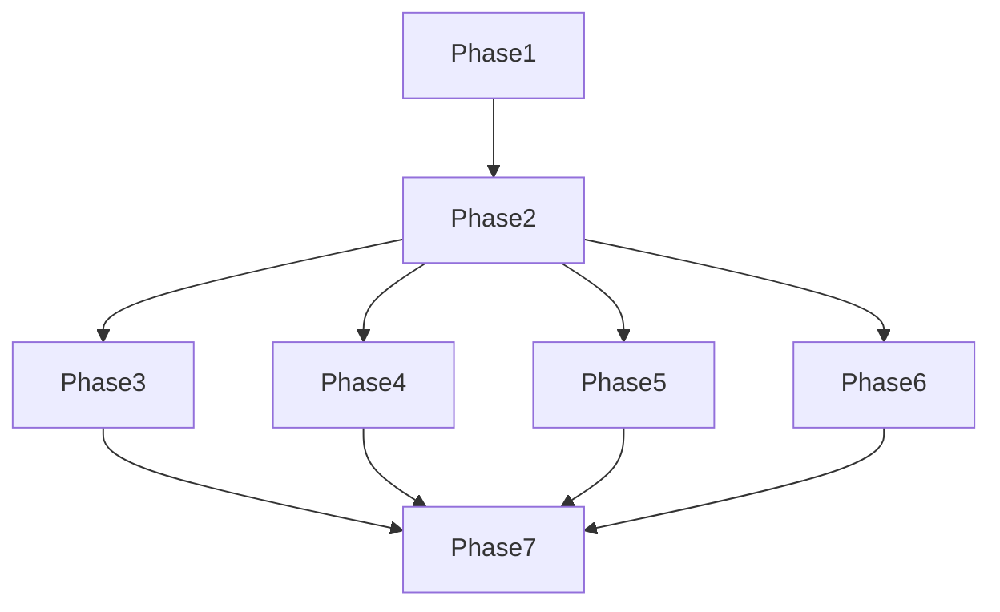

# Tasks: Vision-Language-Action (VLA) Module

**Input**: Design documents from `/specs/4-vla/`
**Prerequisites**: plan.md (required), spec.md (required for user stories), research.md, data-model.md, contracts/

**Tests**: Tests are OPTIONAL - only include them if explicitly requested in the feature specification.

**Organization**: Tasks are grouped by user story to enable independent implementation and testing of each story.

## Format: `[ID] [P?] [Story] Description`

- **[P]**: Can run in parallel (different files, no dependencies)
- **[Story]**: Which user story this task belongs to (e.g., US1, US2, US3)
- Include exact file paths in descriptions

## Path Conventions

- **Documentation project**: `book_frontend/docs/module4/`
- **Configuration**: `book_frontend/`
- **Assets**: `book_frontend/docs/module4/assets/`

## Phase 1: Setup (Shared Infrastructure)

**Purpose**: Project initialization and Docusaurus structure setup

- [ ] T001 Create Module 4 directory structure in book_frontend/docs/module4/
- [ ] T002 Create assets directory for diagrams and code samples in book_frontend/docs/module4/assets/
- [ ] T003 [P] Update Docusaurus configuration to include Module 4 in docusaurus.config.js
- [ ] T004 [P] Add Module 4 to sidebar navigation in book_frontend/sidebars.js
- [ ] T005 Create template files for all four chapters with basic metadata
- [ ] T006 [P] Set up GitHub Pages deployment configuration for Module 4
- [ ] T007 Configure Markdown linting for consistent style
- [ ] T008 Set up automated build validation for Docusaurus

**Checkpoint**: Docusaurus structure ready - content creation can begin

---

## Phase 2: Foundational (Blocking Prerequisites)

**Purpose**: Core content structure that MUST be complete before chapter implementation

**⚠️ CRITICAL**: No chapter work can begin until this phase is complete

- [ ] T009 Create module introduction section explaining VLA concepts and learning objectives
- [ ] T010 [P] Develop consistent chapter template with metadata structure
- [ ] T011 Create glossary of key VLA terms and concepts
- [ ] T012 [P] Set up code example formatting standards and templates
- [ ] T013 Create exercise template with verification criteria structure
- [ ] T014 Develop assessment rubric template for all chapters
- [ ] T015 [P] Create common ROS 2 setup instructions for all practical exercises
- [ ] T016 Create troubleshooting guide template for technical issues

**Checkpoint**: Foundation ready - chapter implementation can now begin in parallel

---

## Phase 3: User Story 1 - Vision-Language-Action Foundations (Priority: P1) 🎯 MVP

**Goal**: Students learn fundamental VLA concepts, architecture, and integration patterns

**Independent Test**: Can be fully tested by having students explain VLA concepts, describe system architecture, and identify key components in a sample VLA pipeline.

### Implementation for User Story 1

- [ ] T017 [US1] Create Chapter 1 file: book_frontend/docs/module4/1-vla-foundations.md
- [ ] T018 [US1] Write VLA overview section with historical context and current applications
- [ ] T019 [US1] Create system architecture section with component diagrams
- [ ] T020 [US1] Develop perception component explanation with sensor integration examples
- [ ] T021 [US1] Write cognition component section covering decision-making processes
- [ ] T022 [US1] Create action component section with execution patterns
- [ ] T023 [US1] Develop integration patterns section showing component interactions
- [ ] T024 [US1] Write ROS 2 integration guide for VLA systems
- [ ] T025 [US1] Create VLA architecture diagram in book_frontend/docs/module4/assets/vla-architecture.png
- [ ] T026 [US1] Develop system design exercise with evaluation criteria
- [ ] T027 [US1] Create assessment rubric for Chapter 1 in book_frontend/docs/module4/assessment-us1.md
- [ ] T028 [US1] Add learning outcomes verification section
- [ ] T029 [US1] Create troubleshooting guide for common VLA setup issues
- [ ] T030 [US1] Add references and citations section

**Checkpoint**: At this point, User Story 1 should be fully functional and testable independently

---

## Phase 4: User Story 2 - Voice-to-Action with OpenAI Whisper (Priority: P2)

**Goal**: Students implement voice command systems using OpenAI Whisper and integrate with ROS 2

**Independent Test**: Can be tested by having students implement a functional voice-to-action pipeline that converts speech commands to robot movements.

### Implementation for User Story 2

- [ ] T031 [US2] Create Chapter 2 file: book_frontend/docs/module4/2-voice-to-action.md
- [ ] T032 [US2] Write speech recognition overview with Whisper introduction
- [ ] T033 [US2] Create Whisper setup guide with installation instructions
- [ ] T034 [US2] Develop basic voice recognition example with Python code
- [ ] T035 [US2] Write command parsing section with intent recognition patterns
- [ ] T036 [US2] Create noise reduction techniques section
- [ ] T037 [US2] Develop ROS 2 action server integration guide
- [ ] T038 [US2] Write feedback mechanisms section for command confirmation
- [ ] T039 [US2] Create basic voice control exercise with step-by-step instructions
- [ ] T040 [US2] Develop advanced command processing exercise with context handling
- [ ] T041 [US2] Create Whisper integration diagram in book_frontend/docs/module4/assets/whisper-integration.png
- [ ] T042 [US2] Write performance optimization section for voice systems
- [ ] T043 [US2] Create troubleshooting guide for voice recognition issues
- [ ] T044 [US2] Add assessment rubric for voice-to-action implementation
- [ ] T045 [US2] Create safety considerations section for voice-controlled robots

**Checkpoint**: User Story 2 provides practical voice command implementation skills

---

## Phase 5: User Story 3 - LLM-Based Cognitive Planning with ROS 2 (Priority: P3)

**Goal**: Students develop cognitive planning systems using LLMs for robot decision-making

**Independent Test**: Can be tested by having students implement an LLM-based planner that generates and executes complex action sequences.

### Implementation for User Story 3

- [ ] T046 [US3] Create Chapter 3 file: book_frontend/docs/module4/3-llm-cognitive-planning.md
- [ ] T047 [US3] Write LLM fundamentals section with model architecture overview
- [ ] T048 [US3] Create prompt engineering guide with best practices
- [ ] T049 [US3] Develop structured output formatting section
- [ ] T050 [US3] Write task decomposition strategies with examples
- [ ] T051 [US3] Create context incorporation section for environmental awareness
- [ ] T052 [US3] Develop adaptive planning techniques for dynamic environments
- [ ] T053 [US3] Write ROS 2 plan execution node implementation guide
- [ ] T054 [US3] Create feedback loop integration for plan adjustment
- [ ] T055 [US3] Develop basic planning exercise with simple task generation
- [ ] T056 [US3] Create context-aware planning exercise with environmental constraints
- [ ] T057 [US3] Write ethical considerations section for AI planning
- [ ] T058 [US3] Create LLM planning diagram in book_frontend/docs/module4/assets/llm-planning.png
- [ ] T059 [US3] Develop performance benchmarking section
- [ ] T060 [US3] Create assessment rubric for cognitive planning implementation
- [ ] T061 [US3] Add error handling section for LLM failures

**Checkpoint**: User Story 3 enables students to implement AI-driven cognitive planning

---

## Phase 6: User Story 4 - Capstone: The Autonomous Humanoid (Priority: P4)

**Goal**: Students integrate all VLA components into a comprehensive autonomous humanoid system

**Independent Test**: Can be tested by having students demonstrate a working autonomous humanoid that performs complex tasks using integrated VLA systems.

### Implementation for User Story 4

- [ ] T062 [US4] Create Chapter 4 file: book_frontend/docs/module4/4-autonomous-humanoid.md
- [ ] T063 [US4] Write system integration overview with architecture patterns
- [ ] T064 [US4] Develop component interface specification guide
- [ ] T065 [US4] Create data flow diagram for end-to-end VLA system
- [ ] T066 [US4] Write performance optimization section for integrated systems
- [ ] T067 [US4] Develop resource management strategies for real-time operation
- [ ] T068 [US4] Create error recovery mechanisms for robust operation
- [ ] T069 [US4] Write safety protocols section with emergency procedures
- [ ] T070 [US4] Develop ethical guidelines for autonomous humanoid systems
- [ ] T071 [US4] Create integration project with system assembly guide
- [ ] T072 [US4] Develop performance tuning exercise with benchmarking
- [ ] T073 [US4] Create comprehensive assessment rubric for capstone project
- [ ] T074 [US4] Write deployment considerations section
- [ ] T075 [US4] Develop demonstration guide for capstone presentations
- [ ] T076 [US4] Create system architecture diagram in book_frontend/docs/module4/assets/capstone-architecture.png

**Checkpoint**: User Story 4 provides comprehensive integration experience

---

## Phase 7: Polish & Cross-Cutting Concerns

**Purpose**: Final integration, quality assurance, and deployment preparation

### Final Integration & Quality Assurance

- [ ] T077 Create comprehensive module index with cross-references
- [ ] T078 [P] Add accessibility considerations to all chapters
- [ ] T079 [P] Create performance benchmarks for all VLA components
- [ ] T080 [P] Add cross-references between related chapters and concepts
- [ ] T081 Create glossary of VLA-specific terms
- [ ] T082 [P] Add links to external resources and documentation
- [ ] T083 Create complete student learning path with prerequisites
- [ ] T084 [P] Verify all code examples are runnable
- [ ] T085 [P] Test complete student journey from foundations through capstone
- [ ] T086 [P] Document hardware requirements and performance expectations
- [ ] T087 Create instructor resources and answer keys
- [ ] T088 [P] Update quickstart guide with final implementation details
- [ ] T089 [P] Create integration examples demonstrating all components working together
- [ ] T090 [P] Add comprehensive troubleshooting guide
- [ ] T091 [P] Create final assessment combining all learning outcomes
- [ ] T092 [P] Document deployment and publishing procedures

### Validation & Testing

- [ ] T093 [P] Validate all Docusaurus builds successfully
- [ ] T094 [P] Test all internal cross-references
- [ ] T095 [P] Verify Markdown formatting consistency
- [ ] T096 [P] Check all code examples for syntax errors
- [ ] T097 [P] Validate diagram references and paths
- [ ] T098 [P] Test search functionality with Module 4 content
- [ ] T099 [P] Verify mobile responsiveness
- [ ] T100 [P] Check accessibility compliance
- [ ] T101 [P] Validate SEO metadata
- [ ] T102 [P] Test deployment to staging environment
- [ ] T103 [P] Perform final content review

---

## Dependencies & Execution Order

### User Story Dependencies

| User Story | Depends On | Can Run In Parallel With |
|------------|------------|--------------------------|
| US1 (Foundations) | Phase 2 | None (P1 - must come first) |
| US2 (Voice-to-Action) | Phase 2, US1 | US3, US4 |
| US3 (LLM Planning) | Phase 2, US1 | US2, US4 |
| US4 (Capstone) | Phase 2, US1, US2, US3 | None (requires all prior) |

### Parallel Execution Examples

**User Story 2 + User Story 3 (Can run concurrently after US1)**:
- Team A: Voice-to-Action implementation (T031-T045)
- Team B: LLM Planning implementation (T046-T061)
- Team C: Foundational content review and polishing

**Polish Phase (Multiple parallel teams)**:
- Team 1: Cross-referencing and glossary (T077-T082)
- Team 2: Validation and testing (T093-T103)
- Team 3: Instructor resources (T087, T091)
- Team 4: Deployment documentation (T092)

---

## Implementation Strategy

### MVP Delivery Approach

**Minimum Viable Product (MVP)**: User Story 1 - Vision-Language-Action Foundations

**MVP Scope**:
- Complete Chapter 1 with all sections
- VLA architecture diagrams
- Foundational exercises
- Assessment rubric
- Basic troubleshooting guide

**MVP Test Criteria**:
- Students can explain VLA concepts and architecture
- Students can identify system components
- Students can design basic VLA integration approaches
- All Chapter 1 content is accessible and properly formatted

### Incremental Delivery Plan

1. **Increment 1 (Week 1-2)**: MVP - User Story 1 + Foundational setup
   - Delivers: Complete VLA foundations chapter
   - Value: Students gain theoretical understanding
   - Test: Conceptual assessment

2. **Increment 2 (Week 3-4)**: User Stories 2 + 3 (parallel)
   - Delivers: Voice-to-action and LLM planning chapters
   - Value: Students gain practical implementation skills
   - Test: Functional demonstrations

3. **Increment 3 (Week 5)**: User Story 4
   - Delivers: Capstone integration project
   - Value: Students synthesize all learning
   - Test: Complete system demonstration

4. **Increment 4 (Week 6)**: Polish and deployment
   - Delivers: Final quality assurance and publishing
   - Value: Production-ready educational module
   - Test: Complete module validation

### Parallel Execution Strategy

**Phase 2-6 Parallel Opportunities**:
- Content writing teams can work on different chapters simultaneously
- Diagram creation can proceed in parallel with content writing
- Code example development can be parallelized
- Assessment rubric creation can be parallelized

**Phase 7 Parallel Opportunities**:
- Quality assurance tasks can be distributed
- Validation tasks can be parallelized
- Documentation tasks can be distributed

### Risk Mitigation

**High Risk Areas**:
- Content consistency across parallel teams
- Integration of parallel-developed components
- Quality assurance coordination

**Mitigation Strategies**:
- Daily standups for parallel teams
- Shared style guides and templates
- Integration checkpoints
- Comprehensive final review phase

---

## Task Summary

### Total Tasks: 103

### Tasks by Phase
- **Phase 1 (Setup)**: 8 tasks
- **Phase 2 (Foundational)**: 8 tasks
- **Phase 3 (US1 - Foundations)**: 13 tasks
- **Phase 4 (US2 - Voice-to-Action)**: 15 tasks
- **Phase 5 (US3 - LLM Planning)**: 15 tasks
- **Phase 6 (US4 - Capstone)**: 16 tasks
- **Phase 7 (Polish)**: 31 tasks

### Parallel Opportunities
- **Phase 1**: 4 parallel tasks (T003, T004, T006, T007)
- **Phase 2**: 4 parallel tasks (T010, T012, T014, T016)
- **Phase 3**: 0 parallel tasks (foundational, sequential)
- **Phase 4**: 0 parallel tasks (can run in parallel with Phase 5)
- **Phase 5**: 0 parallel tasks (can run in parallel with Phase 4)
- **Phase 6**: 0 parallel tasks (depends on Phases 4-5)
- **Phase 7**: 27 parallel tasks (most polish tasks)

### Independent Test Criteria

**User Story 1 (Foundations)**:
- Students can explain VLA concepts and architecture
- Students can identify system components in diagrams
- Students can design basic VLA integration approaches

**User Story 2 (Voice-to-Action)**:
- Students can implement functional voice command systems
- Students can integrate Whisper with ROS 2
- Students can handle noisy environments and errors

**User Story 3 (LLM Planning)**:
- Students can implement LLM-based planning systems
- Students can create context-aware action sequences
- Students can integrate planning with ROS 2 execution

**User Story 4 (Capstone)**:
- Students can integrate all VLA components
- Students can demonstrate end-to-end autonomous behavior
- Students can handle complex real-world scenarios

### Suggested MVP Scope

**Minimum Viable Product**: User Story 1 - Vision-Language-Action Foundations

**MVP Deliverables**:
- Complete Chapter 1: VLA Foundations
- All diagrams and visual aids
- Foundational exercises with solutions
- Assessment rubric
- Basic troubleshooting guide
- Docusaurus integration

**MVP Value Proposition**:
- Provides complete theoretical foundation
- Enables students to understand VLA architecture
- Prepares students for practical implementation
- Establishes consistent structure for subsequent chapters

**MVP Test Plan**:
1. Content accuracy review
2. Diagram validation
3. Exercise testing
4. Docusaurus build verification
5. Accessibility compliance check

This comprehensive task list provides a complete implementation plan for Module 4 - Vision-Language-Action, organized by user stories to enable independent development and testing. The plan follows spec-driven development principles and ensures traceability from requirements to implementation.