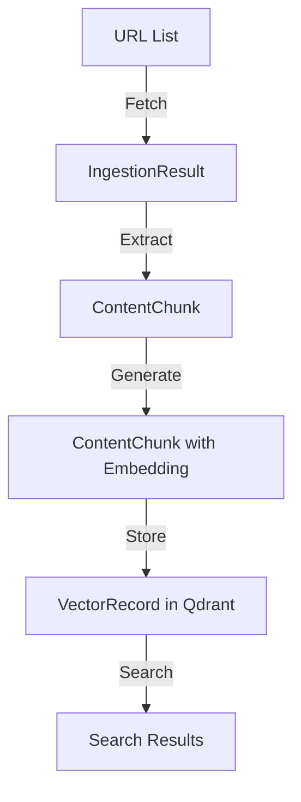
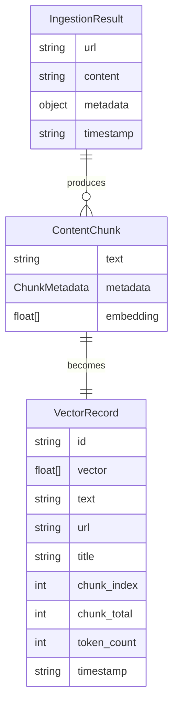

# Data Model: URL Ingestion & Embedding Pipeline

## Entities and Data Structures

### 1. Configuration

**Description**: Central configuration for the ingestion pipeline

**Fields**:
- `COHERE_API_KEY`: string (required) - API key for Cohere embeddings
- `QDRANT_URL`: string (default: "http://localhost:6333") - Qdrant server URL
- `QDRANT_API_KEY`: string (optional) - Qdrant API key if required
- `BASE_URL`: string (default: "https://book-hackathon.vercel.app") - Base URL for book content
- `CHUNK_SIZE`: integer (default: 500) - Target chunk size in tokens
- `OVERLAP`: integer (default: 50) - Overlap between chunks in tokens
- `BATCH_SIZE`: integer (default: 96) - Batch size for Cohere API calls
- `RATE_LIMIT`: float (default: 1.0) - Delay between batches in seconds

**Relationships**: None (global configuration)

**Validation**:
- `CHUNK_SIZE` must be > 0
- `OVERLAP` must be < `CHUNK_SIZE`
- `BATCH_SIZE` must be ≤ 100 (Cohere limit)
- `RATE_LIMIT` must be ≥ 0.1

### 2. IngestionResult

**Description**: Result of ingesting content from a single URL

**Fields**:
- `url`: string - Source URL of the content
- `content`: string - Extracted HTML content
- `metadata`: object - Page metadata
- `timestamp`: string - ISO format timestamp of ingestion

**Nested Metadata Fields**:
- `title`: string - Page title
- `description`: string - Page description
- `keywords`: string - Page keywords
- `language`: string - Page language

**Relationships**:
- Source of ContentChunk entities
- One-to-many relationship with ContentChunk

**Validation**:
- `url` must be valid URL format
- `content` must not be empty
- `timestamp` must be valid ISO format

### 3. ChunkMetadata

**Description**: Metadata associated with each content chunk

**Fields**:
- `url`: string - Source URL
- `title`: string - Source page title
- `chunk_index`: integer - Position in chunk sequence (0-based)
- `chunk_total`: integer - Total number of chunks from source
- `token_count`: integer - Number of tokens in chunk
- `timestamp`: string - ISO format timestamp
- `source`: string (default: "book-hackathon") - Source identifier

**Relationships**:
- Embedded in ContentChunk
- References original IngestionResult

**Validation**:
- `chunk_index` must be ≥ 0
- `chunk_total` must be > 0
- `token_count` must be > 0 and ≤ CHUNK_SIZE + OVERLAP
- `chunk_index` < `chunk_total`

### 4. ContentChunk

**Description**: Processed chunk of content ready for embedding

**Fields**:
- `text`: string - Chunk content
- `metadata`: ChunkMetadata - Associated metadata
- `embedding`: List[float] (optional) - Generated embedding vector

**Relationships**:
- Belongs to one IngestionResult
- Source for VectorRecord
- One-to-one with VectorRecord

**Validation**:
- `text` must not be empty
- `text` length must be ≤ CHUNK_SIZE + OVERLAP (in tokens)
- `embedding` if present must be 1024-dimensional vector

### 5. VectorRecord

**Description**: Record stored in Qdrant vector database

**Fields**:
- `id`: string - Deterministic identifier
- `vector`: List[float] - 1024-dimensional embedding
- `text`: string - Chunk content
- `url`: string - Source URL
- `title`: string - Source title
- `chunk_index`: integer - Chunk position
- `chunk_total`: integer - Total chunks
- `token_count`: integer - Token count
- `timestamp`: string - Processing timestamp
- `source`: string - Source identifier

**Relationships**:
- Stored in Qdrant collection
- References original ContentChunk
- Searchable by vector similarity

**Validation**:
- `id` must be deterministic (SHA-256 based)
- `vector` must be exactly 1024 dimensions
- All fields must be present and valid

## Data Flow

## State Transitions

### IngestionResult Lifecycle
1. **Created**: URL fetched and content extracted
2. **Validated**: Content and metadata validated
3. **Processed**: Content chunked successfully
4. **Completed**: All chunks generated and stored

### ContentChunk Lifecycle
1. **Created**: Text extracted and metadata assigned
2. **Validated**: Token count and content validated
3. **Embedded**: Embedding generated successfully
4. **Stored**: Vector record created in Qdrant
5. **Searchable**: Available for semantic search

## Validation Rules

### URL Validation
- Must start with `http://`, `https://`, or `/`
- If relative path, must be prefixed with BASE_URL
- Must be accessible (HTTP 200 response)
- Must contain valid HTML content

### Content Validation
- Must not be empty after extraction
- Must contain valid text content
- Must not exceed reasonable size limits
- Must be from Docusaurus structure

### Chunk Validation
- Must contain valid text
- Token count must be within bounds
- Must have valid metadata
- Must be traceable to source

### Embedding Validation
- Must be 1024-dimensional vector
- Must not contain NaN or infinite values
- Must be normalized appropriately
- Must be generated from valid text

## Relationships

### Entity Relationship Diagram

## Data Integrity

### Deterministic Processing
- URL-based ID generation using SHA-256
- Consistent chunking algorithm
- Reproducible token counting
- Stable metadata extraction

### Traceability
- Each chunk traceable to source URL
- Chunk position and total preserved
- Original title and metadata maintained
- Processing timestamps recorded

### Error Recovery
- Graceful handling of fetch failures
- Partial success reporting
- Comprehensive error logging
- Retry mechanisms for transient failures

## Performance Considerations

### Memory Usage
- Stream processing where possible
- Batch operations for efficiency
- Memory limits monitoring
- Garbage collection optimization

### Processing Speed
- Parallel processing where safe
- Batch operations for APIs
- Efficient tokenization
- Optimized chunking algorithm

### Storage Efficiency
- Compact vector representation
- Efficient metadata storage
- Collection optimization
- Indexing strategy

## Security Considerations

### Data Protection
- Secure API key management
- Environment variable encryption
- Network communication security
- Input validation and sanitization

### Access Control
- API key protection
- Service authentication
- Rate limiting
- Request validation

### Audit Trail
- Processing timestamps
- Operation logging
- Error tracking
- Performance monitoring

## Conclusion

This data model defines the entities, relationships, and validation rules for the URL Ingestion & Embedding Pipeline. The model ensures data integrity, traceability, and performance while supporting the core functionality of content ingestion, chunking, embedding generation, and vector storage.