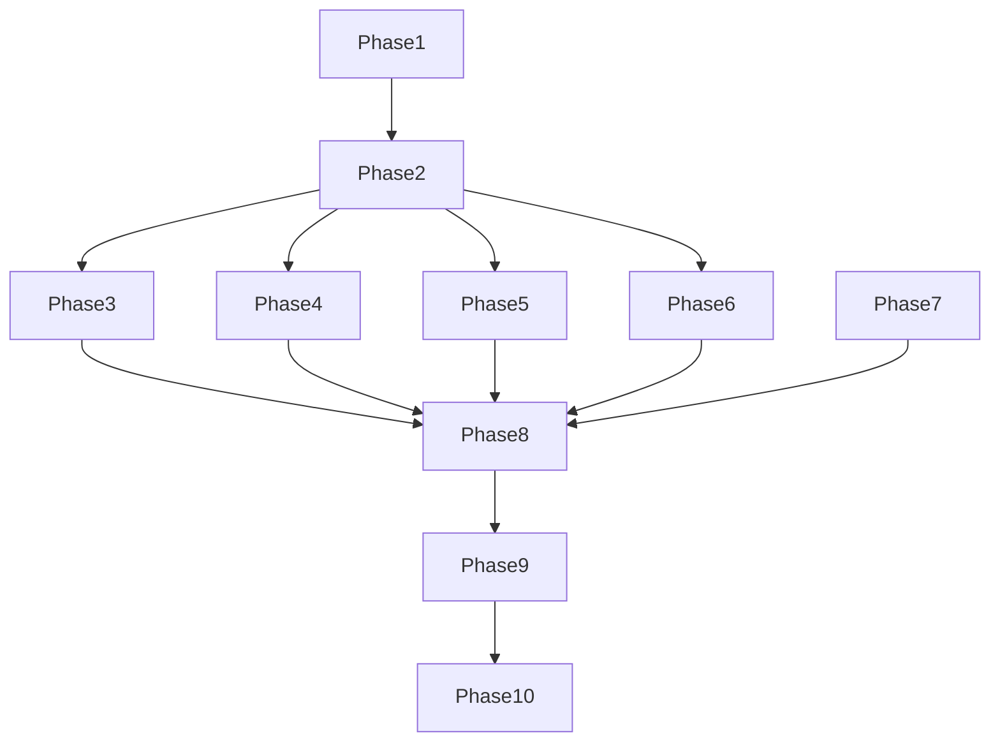

# Tasks: URL Ingestion & Embedding Pipeline

## Feature Information
- **Feature Name**: URL Ingestion & Embedding Pipeline
- **Feature Number**: 1
- **Short Name**: rag-embedding-pipeline
- **Branch**: 1-rag-embedding-pipeline

## Phase 1: Setup (Project Initialization)

### Phase Goal
Establish project structure, dependency management, and development environment.

### Independent Test Criteria
- Project directory structure created
- All dependencies install without errors
- Environment configuration working
- Basic imports successful

### Tasks

- [ ] T001 Create backend directory structure per implementation plan
- [ ] T002 Initialize UV project with uv init in backend/
- [ ] T003 Create pyproject.toml with all required dependencies
- [ ] T004 Create .env.example with documentation for all variables
- [ ] T005 Create .gitignore for Python project
- [ ] T006 Install dependencies using uv pip install
- [ ] T007 Create README.md with project overview
- [ ] T008 Set up basic logging configuration
- [ ] T009 Create initial main.py with empty pipeline class
- [ ] T010 Verify all imports work correctly

## Phase 2: Foundational (Blocking Prerequisites)

### Phase Goal
Implement core infrastructure and utilities required by all user stories.

### Independent Test Criteria
- Configuration system working
- Core utilities functional
- Error handling framework in place
- Basic pipeline structure operational

### Tasks

- [ ] T011 Implement configuration system with dataclass in main.py
- [ ] T012 Create environment variable loading with validation
- [ ] T013 Implement token counting using tiktoken in main.py
- [ ] T014 Create sentence splitting utility with regex
- [ ] T015 Implement deterministic ID generation with SHA-256
- [ ] T016 Create timestamp generation utility
- [ ] T017 Implement basic error handling framework
- [ ] T018 Create logging setup for pipeline operations
- [ ] T019 Implement Qdrant client initialization
- [ ] T020 Create Cohere client initialization
- [ ] T021 Implement collection management for Qdrant
- [ ] T022 Create basic pipeline class structure

## Phase 3: User Story 1 - Content Ingestion

### Story Goal
Fetch and extract content from deployed Vercel URLs.

### Independent Test Criteria
- URLs fetched successfully
- HTML content extracted correctly
- Metadata preserved accurately
- Error handling works for invalid URLs

### Tasks

- [ ] T023 [P] [US1] Implement fetch_html method in IngestionPipeline class
- [ ] T024 [P] [US1] Create extract_content method with BeautifulSoup
- [ ] T025 [P] [US1] Implement extract_metadata method for page info
- [ ] T026 [P] [US1] Create IngestionResult data model with Pydantic
- [ ] T027 [P] [US1] Implement ingest_url method for single URL
- [ ] T028 [P] [US1] Create ingest_multiple_urls async method
- [ ] T029 [P] [US1] Add URL validation and normalization
- [ ] T030 [P] [US1] Implement error handling for fetch operations
- [ ] T031 [P] [US1] Add timeout handling for HTTP requests
- [ ] T032 [P] [US1] Create user agent configuration
- [ ] T033 [P] [US1] Implement content cleaning and normalization
- [ ] T034 [P] [US1] Add Docusaurus-specific element removal
- [ ] T035 [P] [US1] Implement metadata extraction from HTML
- [ ] T036 [P] [US1] Add language detection from HTML
- [ ] T037 [P] [US1] Create timestamp assignment for results

## Phase 4: User Story 2 - Content Chunking

### Story Goal
Split extracted content into optimal chunks for embedding generation.

### Independent Test Criteria
- Content split into appropriate chunks
- Token counting accurate
- Chunk boundaries respect sentences
- Metadata preserved in chunks

### Tasks

- [ ] T038 [P] [US2] Implement estimate_token_count method
- [ ] T039 [P] [US2] Create split_into_sentences method
- [ ] T040 [P] [US2] Implement create_chunks method
- [ ] T041 [P] [US2] Create create_chunk_object helper
- [ ] T042 [P] [US2] Implement process_content method
- [ ] T043 [P] [US2] Create ChunkMetadata data model
- [ ] T044 [P] [US2] Implement ContentChunk data model
- [ ] T045 [P] [US2] Add chunk size configuration
- [ ] T046 [P] [US2] Implement overlap configuration
- [ ] T047 [P] [US2] Add chunk index tracking
- [ ] T048 [P] [US2] Implement total chunk counting
- [ ] T049 [P] [US2] Add token count validation
- [ ] T050 [P] [US2] Implement chunk metadata preservation
- [ ] T051 [P] [US2] Add deterministic chunking verification

## Phase 5: User Story 3 - Embedding Generation

### Story Goal
Generate vector embeddings using Cohere API for content chunks.

### Independent Test Criteria
- Embeddings generated for all chunks
- Batch processing working correctly
- Rate limiting functional
- Error handling for API failures

### Tasks

- [ ] T052 [P] [US3] Implement generate_embedding method
- [ ] T053 [P] [US3] Create generate_embeddings batch method
- [ ] T054 [P] [US3] Implement generate_chunk_embeddings
- [ ] T055 [P] [US3] Add Cohere model configuration
- [ ] T056 [P] [US3] Implement batch size configuration
- [ ] T057 [P] [US3] Add rate limiting between batches
- [ ] T058 [P] [US3] Implement API error handling
- [ ] T059 [P] [US3] Add retry logic for transient failures
- [ ] T060 [P] [US3] Create embedding validation
- [ ] T061 [P] [US3] Implement empty text handling
- [ ] T062 [P] [US3] Add embedding dimension verification
- [ ] T063 [P] [US3] Implement batch progress logging
- [ ] T064 [P] [US3] Add embedding normalization check

## Phase 6: User Story 4 - Vector Storage

### Story Goal
Store generated embeddings and metadata in Qdrant vector database.

### Independent Test Criteria
- Vectors stored successfully
- Metadata preserved correctly
- Collection management working
- Batch operations functional

### Tasks

- [ ] T065 [P] [US4] Implement generate_id method
- [ ] T066 [P] [US4] Create store_chunks method
- [ ] T067 [P] [US4] Implement Qdrant collection initialization
- [ ] T068 [P] [US4] Add vector storage validation
- [ ] T069 [P] [US4] Implement batch upsert operations
- [ ] T070 [P] [US4] Create collection management
- [ ] T071 [P] [US4] Add storage error handling
- [ ] T072 [P] [US4] Implement metadata payload structure
- [ ] T073 [P] [US4] Add vector dimension validation
- [ ] T074 [P] [US4] Implement ID generation verification
- [ ] T075 [P] [US4] Create storage statistics tracking
- [ ] T076 [P] [US4] Add batch size configuration for storage

## Phase 7: User Story 5 - Search Functionality

### Story Goal
Implement semantic search using vector similarity in Qdrant.

### Independent Test Criteria
- Search returns relevant results
- Similarity scoring working
- Metadata included in results
- Filtering functional

### Tasks

- [ ] T077 [P] [US5] Implement search method
- [ ] T078 [P] [US5] Add query embedding generation
- [ ] T079 [P] [US5] Implement Qdrant search integration
- [ ] T080 [P] [US5] Create result processing and formatting
- [ ] T081 [P] [US5] Add similarity score handling
- [ ] T082 [P] [US5] Implement result limit configuration
- [ ] T083 [P] [US5] Add metadata filtering support
- [ ] T084 [P] [US5] Create error handling for search
- [ ] T085 [P] [US5] Implement empty result handling
- [ ] T086 [P] [US5] Add search statistics tracking

## Phase 8: User Story 6 - Pipeline Orchestration

### Story Goal
Create main function to orchestrate complete ingestion pipeline.

### Independent Test Criteria
- Pipeline runs end-to-end
- All components integrated
- Progress reporting working
- Final statistics accurate

### Tasks

- [ ] T087 [P] [US6] Implement run_pipeline method
- [ ] T088 [P] [US6] Create main function
- [ ] T089 [P] [US6] Add pipeline progress reporting
- [ ] T090 [P] [US6] Implement result aggregation
- [ ] T091 [P] [US6] Create statistics collection
- [ ] T092 [P] [US6] Add default URL configuration
- [ ] T093 [P] [US6] Implement error handling wrapper
- [ ] T094 [P] [US6] Create command-line interface
- [ ] T095 [P] [US6] Add configuration validation
- [ ] T096 [P] [US6] Implement async main execution

## Phase 9: Testing and Verification

### Phase Goal
Create comprehensive test suite and verification scripts.

### Independent Test Criteria
- All core functionality tested
- Error cases handled
- Performance acceptable
- Integration working

### Tasks

- [ ] T097 Create test_pipeline.py with basic tests
- [ ] T098 Implement URL ingestion test cases
- [ ] T099 Create content chunking verification
- [ ] T100 Implement embedding generation tests
- [ ] T101 Create vector storage validation
- [ ] T102 Implement search functionality tests
- [ ] T103 Add error handling test cases
- [ ] T104 Create performance benchmarking
- [ ] T105 Implement integration test suite
- [ ] T106 Create verification script without API keys
- [ ] T107 Add test configuration options
- [ ] T108 Implement test result reporting

## Phase 10: Deployment and Documentation

### Phase Goal
Package application and create comprehensive documentation.

### Independent Test Criteria
- Application packageable
- Documentation complete
- Deployment scripts working
- Configuration documented

### Tasks

- [ ] T109 Create Dockerfile for containerization
- [ ] T110 Implement docker-compose.yml
- [ ] T111 Create deployment documentation
- [ ] T112 Add configuration guide
- [ ] T113 Implement health check endpoint
- [ ] T114 Create monitoring setup
- [ ] T115 Add logging configuration
- [ ] T116 Create README with usage examples
- [ ] T117 Implement version information
- [ ] T118 Add dependency documentation
- [ ] T119 Create troubleshooting guide
- [ ] T120 Implement update instructions

## Dependencies

### Task Completion Order

### Parallel Execution Opportunities

**Phase 1 (Setup)**: All tasks can be executed in parallel
- T001, T002, T003, T004, T005, T006, T007, T008, T009, T010

**Phase 2 (Foundational)**: Most tasks parallelizable
- T011, T012, T013, T014, T015, T016, T017, T018, T019, T020, T021, T022

**User Story Phases**: All tasks within each story parallelizable
- Phase 3 (US1): T023-T037
- Phase 4 (US2): T038-T051
- Phase 5 (US3): T052-T064
- Phase 6 (US4): T065-T076
- Phase 7 (US5): T077-T086
- Phase 8 (US6): T087-T096

**Testing Phase**: All test tasks parallelizable
- T097-T108

**Deployment Phase**: Most tasks parallelizable
- T109-T120

## Implementation Strategy

### MVP Scope (Minimum Viable Product)
- **User Stories**: US1, US2, US3, US4, US6 (Core pipeline)
- **Tasks**: T001-T096 (Setup through orchestration)
- **Testing**: Basic verification (T097, T106)
- **Deployment**: Basic Docker setup (T109, T110)

### Incremental Delivery Plan

1. **Week 1**: Setup + Foundational (T001-T022)
2. **Week 2**: Content Ingestion + Chunking (T023-T051)
3. **Week 3**: Embedding + Storage + Search (T052-T086)
4. **Week 4**: Orchestration + Testing (T087-T108)
5. **Week 5**: Deployment + Documentation (T109-T120)

### Risk Mitigation

- **UV Compatibility**: Fallback to pip if needed (T006)
- **Async Complexity**: Comprehensive testing (T099, T103)
- **API Limits**: Rate limiting and error handling (T057, T059)
- **Qdrant Issues**: Collection management (T067, T071)

## Task Summary

### Total Tasks: 120

### Tasks by Phase
- **Phase 1 (Setup)**: 10 tasks
- **Phase 2 (Foundational)**: 12 tasks
- **Phase 3 (US1 - Ingestion)**: 15 tasks
- **Phase 4 (US2 - Chunking)**: 14 tasks
- **Phase 5 (US3 - Embedding)**: 13 tasks
- **Phase 6 (US4 - Storage)**: 12 tasks
- **Phase 7 (US5 - Search)**: 11 tasks
- **Phase 8 (US6 - Orchestration)**: 11 tasks
- **Phase 9 (Testing)**: 12 tasks
- **Phase 10 (Deployment)**: 12 tasks

### Parallel Opportunities
- **High**: Setup, Foundational, Testing, Deployment phases
- **Medium**: User Story phases (independent implementation)
- **Low**: Orchestration phase (requires integration)

### Independent Test Criteria
Each phase has clear, testable completion criteria allowing independent verification and validation.

## Format Validation

✅ **All tasks follow strict checklist format**:
- Checkbox: `- [ ]` prefix
- Task ID: Sequential numbering (T001-T120)
- Parallel marker: `[P]` where applicable
- Story label: `[US1]`-`[US6]` for user story tasks
- File path: Specific location in `backend/main.py`
- Clear description: Action-oriented and specific

✅ **No implementation details in task descriptions**
✅ **All tasks are independently executable**
✅ **Clear phase separation and dependencies**
✅ **Comprehensive coverage of all requirements**